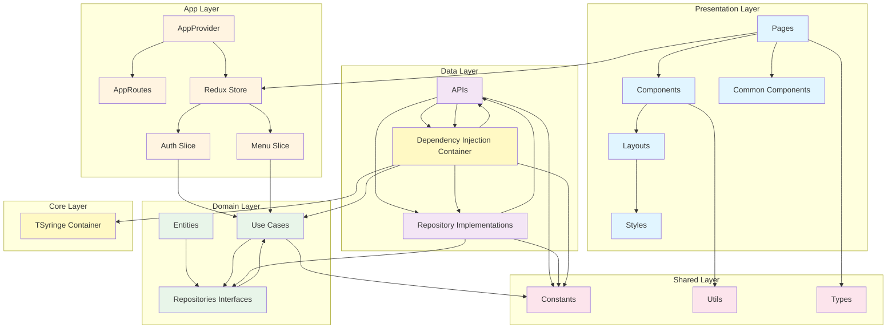
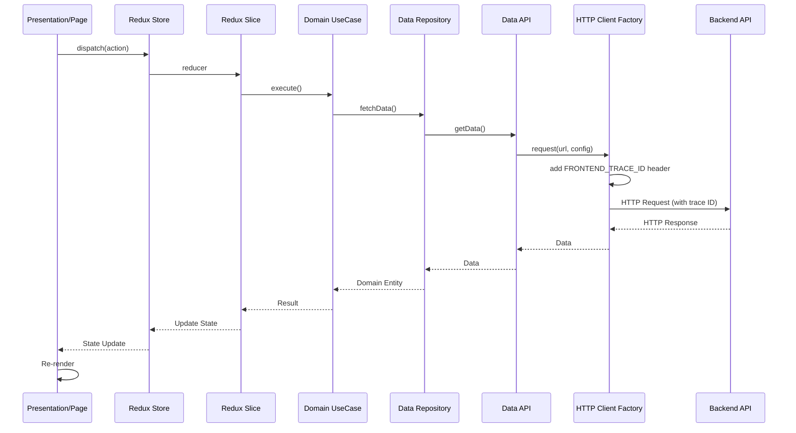
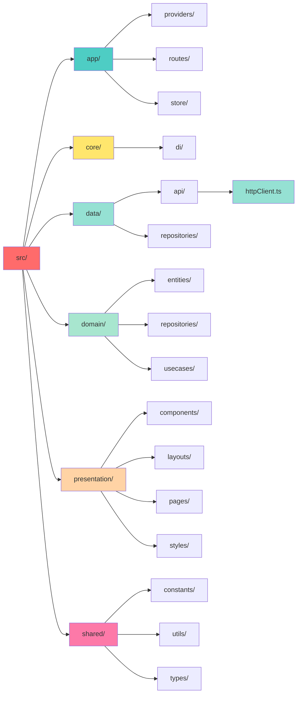
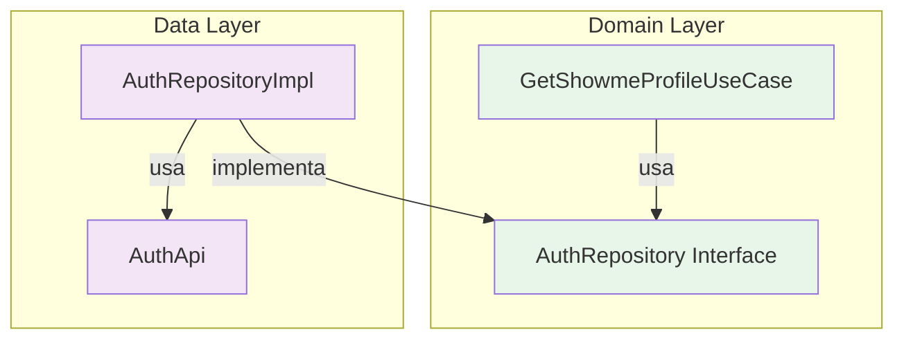
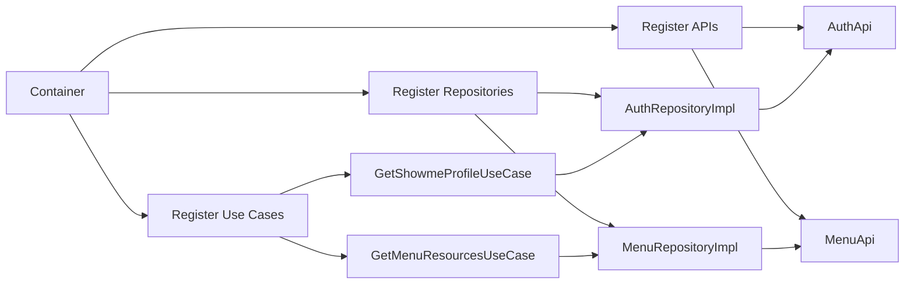
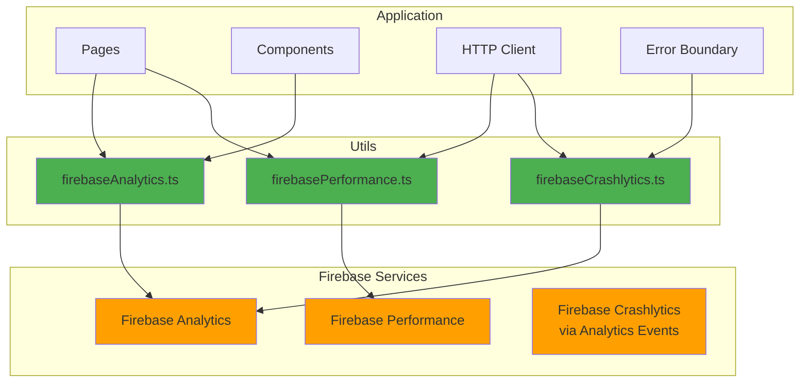
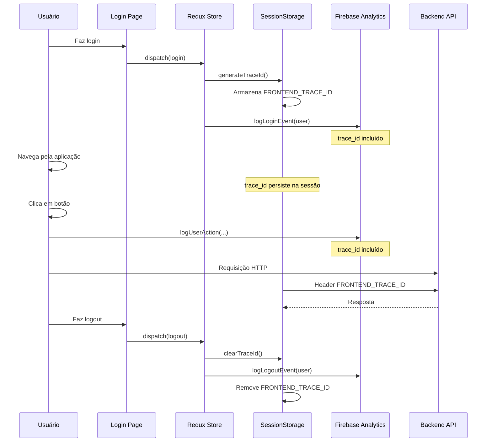

# Arquitetura da Aplicação

Este documento descreve a arquitetura da aplicação Fourmakers-v2, que segue os princípios da Clean Architecture.

## Diagrama de Arquitetura



## Fluxo de Dados



## Estrutura de Pastas



## Camadas da Arquitetura

### 1. Presentation Layer
**Responsabilidade**: Interface do usuário e interação

- **Pages**: Páginas da aplicação (Login, Dashboard, etc.)
- **Components**: Componentes reutilizáveis
- **Layouts**: Layouts principais (MainLayout)
- **Styles**: Estilos com styled-components (theme, GlobalStyles)

### 2. App Layer
**Responsabilidade**: Configuração da aplicação e gerenciamento de estado global

- **AppProvider**: Provider principal com Redux, Router e Theme
- **AppRoutes**: Configuração de rotas
- **Store**: Redux store com slices (auth, menu)

### 3. Domain Layer
**Responsabilidade**: Regras de negócio e entidades

- **Entities**: Entidades de domínio (ShowmeUserProfile, MenuResource)
- **Repositories**: **Interfaces** de repositórios (contratos, não implementações)
- **Use Cases**: Casos de uso (GetShowmeProfileUseCase, GetMenuResourcesUseCase)

### 4. Data Layer
**Responsabilidade**: Acesso a dados externos

- **APIs**: Clientes HTTP (AuthApi, MenuApi)
- **Repositories**: **Implementações** dos repositórios (AuthRepositoryImpl, MenuRepositoryImpl)

#### HTTP Client Factory

**IMPORTANTE**: Todas as implementações HTTP devem utilizar a factory `httpClient` localizada em `@data/api/httpClient.ts`.

A factory centraliza todas as chamadas HTTP e garante:
- Inclusão automática do header `FRONTEND_TRACE_ID` quando disponível
- Configuração consistente de headers (Content-Type, Authorization)
- Tratamento padronizado de erros
- Suporte para diferentes métodos HTTP (GET, POST, PUT, PATCH, DELETE)
- Suporte para downloads de arquivos (postBlob)

**Localização**: `src/data/api/httpClient.ts`

**Exemplo de uso**:

```typescript
import { httpClient } from './httpClient'

export class NovaApi {
  async buscarDados(token: string): Promise<DadosResponse> {
    return httpClient.get<DadosResponse>(
      '/api/endpoint/dados',
      { token }
    )
  }

  async criarDados(token: string, payload: DadosPayload): Promise<DadosResponse> {
    return httpClient.post<DadosResponse>(
      '/api/endpoint/dados',
      payload,
      { token }
    )
  }
}
```

**Para APIs com base URL diferente**:

```typescript
import { createHttpClient } from './httpClient'

const customClient = createHttpClient({ 
  baseURL: 'https://api.externa.com' 
})

export class ApiExterna {
  async buscarDados(token: string): Promise<DadosResponse> {
    return customClient.get<DadosResponse>(
      '/endpoint',
      { token }
    )
  }
}
```

**Gerenciamento de Trace ID**:

O `FRONTEND_TRACE_ID` é gerenciado automaticamente:
- Gerado e armazenado no `sessionStorage` durante o login
- Incluído automaticamente em todas as requisições HTTP
- Removido do `sessionStorage` durante o logout

**Funções disponíveis**:
- `generateTraceId()`: Gera um novo trace ID único
- `setTraceId(traceId)`: Armazena o trace ID no sessionStorage
- `getTraceId()`: Obtém o trace ID atual
- `clearTraceId()`: Remove o trace ID do sessionStorage

**⚠️ Regra obrigatória**: Nenhuma API deve usar `fetch()` diretamente. Sempre utilize a factory `httpClient` ou `createHttpClient()`.

## Por que duas pastas "repositories"?

Esta é uma questão fundamental da Clean Architecture e do princípio de **Dependency Inversion** (SOLID):

### Domain/repositories (Interfaces)
```typescript
// domain/repositories/AuthRepository.ts
export interface AuthRepository {
  fetchShowmeProfile(token: string): Promise<ShowmeUserProfile>
  logout(token: string, cpf: string): Promise<void>
}
```
- Define **o que** um repositório deve fazer (contrato)
- Não sabe **como** será implementado
- Pertence à camada de domínio (mais interna)
- Não depende de nenhuma implementação externa

### Data/repositories (Implementações)
```typescript
// data/repositories/AuthRepositoryImpl.ts
export class AuthRepositoryImpl implements AuthRepository {
  constructor(private readonly api: AuthApi) {}
  
  async fetchShowmeProfile(token: string): Promise<ShowmeUserProfile> {
    return this.api.getShowmeProfile(token) // Implementação concreta
  }
}
```
- Implementa **como** o repositório funciona
- Usa APIs HTTP, banco de dados, etc.
- Pertence à camada de dados (mais externa)
- Depende da interface definida em Domain

### Diagrama de Dependência



### Benefícios

1. **Inversão de Dependência**: Domain não depende de Data, mas Data depende de Domain
2. **Testabilidade**: Pode criar mocks implementando a interface
3. **Flexibilidade**: Pode trocar a implementação sem afetar o domínio
4. **Desacoplamento**: Lógica de negócio independente de detalhes de implementação

### Exemplo Prático

```typescript
// Use Case usa apenas a INTERFACE (Domain)
class GetShowmeProfileUseCase {
  constructor(
    private readonly repository: AuthRepository // ← Interface, não implementação
  ) {}
}

// A implementação CONCRETA fica em Data
class AuthRepositoryImpl implements AuthRepository {
  // Pode usar HTTP, GraphQL, WebSocket, etc.
  // O Use Case não precisa saber disso!
}
```

### 5. Core Layer
**Responsabilidade**: Infraestrutura e configuração

- **Dependency Injection**: Container TSyringe para injeção de dependências

### 6. Shared Layer
**Responsabilidade**: Código compartilhado entre camadas

- **Constants**: Constantes (API URLs, configurações)
- **Utils**: Funções utilitárias
- **Types**: Tipos TypeScript compartilhados

## Princípios da Clean Architecture

1. **Independência de Frameworks**: A lógica de negócio não depende de frameworks externos
2. **Testabilidade**: Cada camada pode ser testada independentemente
3. **Independência de UI**: A interface pode mudar sem afetar a lógica de negócio
4. **Independência de Banco de Dados**: A persistência pode ser alterada sem afetar outras camadas
5. **Independência de Agentes Externos**: APIs externas não afetam a lógica de negócio

## Fluxo de Dependências

As dependências seguem a regra: **camadas externas dependem de camadas internas, nunca o contrário**.

```
Presentation → App → Domain ← Data
     ↓           ↓      ↑        ↑
  Shared ←──────┴──────┴────────┘
     ↑
   Core
```

## Dependency Injection

O TSyringe é usado para gerenciar dependências:



## Diretrizes para Implementações HTTP

### ⚠️ Regra Obrigatória

**TODAS as chamadas HTTP devem ser feitas através da factory `httpClient` ou `createHttpClient()`.**

**NÃO é permitido**:
- ❌ Usar `fetch()` diretamente nas APIs
- ❌ Criar novos clientes HTTP sem usar a factory
- ❌ Fazer requisições HTTP fora da camada `@data/api`

**É obrigatório**:
- ✅ Importar `httpClient` de `@data/api/httpClient`
- ✅ Usar os métodos da factory (`get`, `post`, `put`, `patch`, `delete`, `postBlob`)
- ✅ Centralizar todas as APIs em `@data/api`

### Estrutura Padrão de uma API

```typescript
// src/data/api/NovaApi.ts
import { httpClient } from './httpClient'

export interface NovaApiResponse {
  sucesso: boolean
  dados: unknown
}

export class NovaApi {
  // GET request
  async buscarDados(token: string): Promise<NovaApiResponse> {
    return httpClient.get<NovaApiResponse>(
      '/api/endpoint/dados',
      { token }
    )
  }

  // POST request
  async criarDados(token: string, payload: unknown): Promise<NovaApiResponse> {
    return httpClient.post<NovaApiResponse>(
      '/api/endpoint/dados',
      payload,
      { token }
    )
  }

  // GET com query params
  async buscarComFiltros(
    token: string, 
    params: { filtro: string; pagina: number }
  ): Promise<NovaApiResponse> {
    const queryParams = new URLSearchParams({
      filtro: params.filtro,
      pagina: params.pagina.toString(),
    })
    
    return httpClient.get<NovaApiResponse>(
      `/api/endpoint/dados?${queryParams.toString()}`,
      { token }
    )
  }

  // POST com headers customizados
  async enviarComHeaders(
    token: string,
    payload: unknown
  ): Promise<NovaApiResponse> {
    return httpClient.post<NovaApiResponse>(
      '/api/endpoint/dados',
      payload,
      {
        token,
        headers: {
          'Accept-Language': 'pt-BR',
          'Custom-Header': 'valor',
        },
      }
    )
  }
}
```

### Benefícios da Centralização

1. **Rastreabilidade**: O `FRONTEND_TRACE_ID` é incluído automaticamente em todas as requisições
2. **Consistência**: Headers e tratamento de erros padronizados
3. **Manutenibilidade**: Mudanças na configuração HTTP afetam todas as APIs
4. **Testabilidade**: Mais fácil mockar e testar
5. **Observabilidade**: Facilita rastreamento e debugging de requisições

### Checklist para Novas APIs

Ao criar uma nova API, certifique-se de:

- [ ] Importar `httpClient` de `@data/api/httpClient`
- [ ] Usar métodos da factory (`get`, `post`, etc.) ao invés de `fetch()`
- [ ] Passar o `token` no objeto de configuração
- [ ] Definir tipos TypeScript para requests e responses
- [ ] Centralizar o arquivo em `@data/api`
- [ ] Não usar `API_BASE_URL` diretamente (a factory já gerencia isso)
## Criação de Componentes Dialog/Modal

### Estrutura e Organização

**IMPORTANTE**: Todos os componentes de Dialog/Modal devem ser criados em arquivos separados dentro da pasta `@presentation/components`, organizados por fluxo/funcionalidade.

### Localização

Os modais devem ser criados em uma pasta específica do fluxo dentro de `src/presentation/components`:

```
src/presentation/components/
  ├── dashboard/
  │   ├── UserInfoModal.tsx
  │   └── index.ts
  ├── minha-jornada/
  │   ├── PdiCreationModal.tsx
  │   ├── SkillSuggestionModal.tsx
  │   └── index.ts
  ├── profile/
  │   ├── AILoadingModal.tsx
  │   └── index.ts
  └── reembolso/
      └── ...
```

### Estrutura Padrão de um Modal

```typescript
// src/presentation/components/[fluxo]/[NomeModal].tsx
import { useAppSelector } from '@app/store/hooks';
import { Button } from '@/components/ui/button';
import {
  Dialog,
  DialogContent,
  DialogDescription,
  DialogFooter,
  DialogHeader,
  DialogTitle,
  DialogTrigger,
} from '@/components/ui/dialog';
import { Card, CardContent, CardDescription, CardHeader, CardTitle } from '@/components/ui/card';

interface NomeModalProps {
  open: boolean;
  onOpenChange: (open: boolean) => void;
  trigger?: React.ReactNode;
  // Outras props específicas do modal
}

export const NomeModal = ({ open, onOpenChange, trigger, ...props }: NomeModalProps) => {
  // Lógica do componente
  const { user } = useAppSelector((state) => state.auth);

  return (
    <Dialog open={open} onOpenChange={onOpenChange}>
      {trigger && <DialogTrigger asChild>{trigger}</DialogTrigger>}
      <DialogContent className="max-w-2xl max-h-[90vh] overflow-y-auto">
        <DialogHeader>
          <DialogTitle>Título do Modal</DialogTitle>
          <DialogDescription>Descrição do modal</DialogDescription>
        </DialogHeader>

        <div className="space-y-4 py-4">
          {/* Conteúdo do modal */}
        </div>

        <DialogFooter>
          <Button variant="outline" onClick={() => onOpenChange(false)}>
            Cancelar
          </Button>
          <Button onClick={handleSubmit}>
            Confirmar
          </Button>
        </DialogFooter>
      </DialogContent>
    </Dialog>
  );
};
```

### Props Obrigatórias

Todos os modais devem implementar as seguintes props:

- **`open: boolean`**: Controla se o modal está aberto ou fechado
- **`onOpenChange: (open: boolean) => void`**: Callback para atualizar o estado de abertura/fechamento
- **`trigger?: React.ReactNode`**: (Opcional) Elemento que dispara a abertura do modal

### Exemplo Prático: UserInfoModal

```typescript
// src/presentation/components/dashboard/UserInfoModal.tsx
import { useAppSelector } from '@app/store/hooks';
import { Button } from '@/components/ui/button';
import {
  Dialog,
  DialogContent,
  DialogDescription,
  DialogFooter,
  DialogHeader,
  DialogTitle,
  DialogTrigger,
} from '@/components/ui/dialog';
import { Card, CardContent, CardDescription, CardHeader, CardTitle } from '@/components/ui/card';
import { Info, User, Mail, Building2 } from '@/components/ui/system-icons';

interface UserInfoModalProps {
  open: boolean;
  onOpenChange: (open: boolean) => void;
  trigger?: React.ReactNode;
}

export const UserInfoModal = ({ open, onOpenChange, trigger }: UserInfoModalProps) => {
  const { user, token, status } = useAppSelector((state) => state.auth);

  return (
    <Dialog open={open} onOpenChange={onOpenChange}>
      {trigger && <DialogTrigger asChild>{trigger}</DialogTrigger>}
      <DialogContent className="max-w-2xl max-h-[90vh] overflow-y-auto">
        <DialogHeader>
          <div className="flex items-center gap-3">
            <div className="p-2 bg-primary/10 rounded-lg">
              <User className="h-6 w-6 text-primary" />
            </div>
            <div>
              <DialogTitle className="text-2xl font-bold">
                Informações do Usuário
              </DialogTitle>
              <DialogDescription className="mt-1">
                Visualize os detalhes da sua conta e perfil
              </DialogDescription>
            </div>
          </div>
        </DialogHeader>

        <div className="space-y-4 py-4">
          {/* Conteúdo do modal com Cards */}
        </div>

        <DialogFooter>
          <Button variant="outline" onClick={() => onOpenChange(false)}>
            Fechar
          </Button>
          <Button onClick={() => onOpenChange(false)}>
            Entendido
          </Button>
        </DialogFooter>
      </DialogContent>
    </Dialog>
  );
};
```

### Uso em Páginas

```typescript
// src/presentation/pages/Dashboard.tsx
import { useState } from 'react';
import { UserInfoModal } from '@presentation/components/dashboard';
import { Button } from '@/components/ui/button';
import { Info } from '@/components/ui/system-icons';

export function Dashboard() {
  const [isInfoModalOpen, setIsInfoModalOpen] = useState(false);

  return (
    <div>
      <UserInfoModal
        open={isInfoModalOpen}
        onOpenChange={setIsInfoModalOpen}
        trigger={
          <Button variant="secondary" className="gap-2">
            <Info className="h-4 w-4" />
            Informações do Usuário
          </Button>
        }
      />
    </div>
  );
}
```

### Arquivo index.ts

Cada pasta de componentes deve ter um arquivo `index.ts` para facilitar os imports:

```typescript
// src/presentation/components/dashboard/index.ts
export { UserInfoModal } from './UserInfoModal';
```

### Boas Práticas

1. **Separação de Responsabilidades**: 
   - Modais devem ser componentes isolados e reutilizáveis
   - A lógica de negócio deve estar no modal, não na página

2. **Gerenciamento de Estado**:
   - Use Redux para dados globais (ex: `useAppSelector`)
   - Use `useState` local para estado específico do modal
   - O estado de abertura/fechamento deve ser controlado pelo componente pai

3. **Acessibilidade**:
   - Sempre inclua `DialogTitle` e `DialogDescription`
   - Use `DialogTrigger` quando houver um elemento que abre o modal
   - Implemente navegação por teclado (ESC para fechar)

4. **Estilização**:
   - Use classes Tailwind consistentes com o design system
   - Adicione `max-h-[90vh] overflow-y-auto` para modais com conteúdo extenso
   - Defina `max-w-*` apropriado para o tamanho do modal

5. **Estrutura de Conteúdo**:
   - Use `Card` para organizar seções de conteúdo
   - Use `DialogHeader` para título e descrição
   - Use `DialogFooter` para ações (botões de cancelar/confirmar)

6. **Nomenclatura**:
   - Nome do arquivo: `[Nome]Modal.tsx` (ex: `UserInfoModal.tsx`)
   - Nome do componente: `[Nome]Modal` (ex: `UserInfoModal`)
   - Pasta: nome do fluxo em kebab-case (ex: `dashboard`, `minha-jornada`)

### Checklist para Novos Modais

Ao criar um novo modal, certifique-se de:

- [ ] Criar o arquivo na pasta correta dentro de `@presentation/components/[fluxo]/`
- [ ] Implementar as props obrigatórias (`open`, `onOpenChange`, `trigger?`)
- [ ] Usar componentes UI do projeto (`Dialog`, `Button`, `Card`, etc.)
- [ ] Adicionar `DialogTitle` e `DialogDescription` para acessibilidade
- [ ] Incluir botões de ação no `DialogFooter`
- [ ] Exportar o componente no `index.ts` da pasta
- [ ] Testar abertura/fechamento do modal
- [ ] Verificar responsividade e scroll quando necessário
- [ ] Seguir os padrões de nomenclatura

## Tecnologias Utilizadas

- **React 19**: Biblioteca UI
- **Redux Toolkit**: Gerenciamento de estado
- **Styled Components**: Estilização
- **React Router**: Roteamento
- **TSyringe**: Dependency Injection
- **TypeScript**: Tipagem estática
- **Vite**: Build tool
- **Firebase**: Analytics, Performance Monitoring e Crashlytics

---

## Firebase Integration

A aplicação utiliza o Firebase para observabilidade completa, incluindo Analytics, Performance Monitoring e Crashlytics (usando Analytics Events para erros).

### Configuração

**Localização**: `src/core/config/firebase.ts`

A configuração do Firebase é centralizada e inicializada automaticamente ao iniciar a aplicação:

```typescript
// Inicialização automática
import '@core/config/firebase'
```

### Variáveis de Ambiente Necessárias

```env
VITE_FIREBASE_API_KEY=your-api-key
VITE_FIREBASE_AUTH_DOMAIN=your-project.firebaseapp.com
VITE_FIREBASE_PROJECT_ID=your-project-id
VITE_FIREBASE_STORAGE_BUCKET=your-project.appspot.com
VITE_FIREBASE_MESSAGING_SENDER_ID=your-sender-id
VITE_FIREBASE_APP_ID=your-app-id
VITE_FIREBASE_MEASUREMENT_ID=G-XXXXXXXXXX  # Necessário para Analytics
```

### Arquitetura do Firebase



---

## Firebase Analytics

### 1. Rastreamento Automático de Páginas

**Implementação**: `src/shared/hooks/usePageTracking.ts`

Todas as visualizações de página são rastreadas automaticamente através do hook `usePageTracking`, integrado no `AppProvider`.

```typescript
// src/app/providers/AppProvider.tsx
import { PageTracker } from '@app/components/PageTracker'

export const AppProvider = ({ children }: AppProviderProps) => {
  return (
    <Provider store={store}>
      <ThemeProvider theme={theme}>
        <BrowserRouter>
          <GlobalStyles />
          <PageTracker />  {/* Rastreamento automático */}
          {children ?? <AppRoutes />}
        </BrowserRouter>
      </ThemeProvider>
    </Provider>
  )
}
```

#### Dados Coletados Automaticamente em Page Views

```javascript
{
  event: 'page_view',
  page_path: '/dashboard',
  page_title: 'Dashboard',
  page_location: 'https://app.fourmakers.com.br/dashboard',
  timestamp: '2026-01-19T...',
  trace_id: 'abc-123-xyz',
  
  // Dados do usuário (se autenticado)
  user_id: '12345678900',
  user_email: 'usuario@example.com',
  user_name: 'João da Silva',
  user_role: 'Desenvolvedor',
  user_department: 'Tecnologia',
  org_id: '1',
  org_name: 'Diretoria de TI'
}
```

### 2. Rastreamento de Ações do Usuário

**Localização**: `src/shared/utils/firebaseAnalytics.ts`

Use a função `logUserAction` para registrar ações importantes do usuário:

```typescript
import { logUserAction } from '@shared/utils/firebaseAnalytics'
import { useAppSelector } from '@app/store/hooks'

function MyComponent() {
  const user = useAppSelector((state) => state.auth.user)

  const handleAction = () => {
    // Registra a ação do usuário
    logUserAction(
      'GestaoColaboradores',           // Identificador do fluxo
      'FormularioNovoColaborador',     // Nome da funcionalidade
      { dadosAdicionais: 'valor' },    // Dados opcionais
      user                             // Usuário (opcional, obtido automaticamente se não fornecido)
    )
    
    // Executa a ação
    navigate('/colaboradores/novo')
  }

  return (
    <Button onClick={handleAction}>
      Adicionar Colaborador
    </Button>
  )
}
```

#### Estrutura do Evento user_action

```javascript
{
  event: 'user_action',
  flow_identifier: 'GestaoColaboradores',
  feature_name: 'FormularioNovoColaborador',
  page_location: 'https://...',
  timestamp: '2026-01-19T...',
  trace_id: 'abc-123',
  
  // Dados do usuário (automáticos)
  user_id: '12345678900',
  user_email: 'usuario@example.com',
  user_name: 'João da Silva',
  user_role: 'Gestor de RH',
  user_department: 'Recursos Humanos',
  org_id: '1',
  org_name: 'Diretoria de RH',
  
  // Dados adicionais (se fornecidos)
  colaboradorId: '789'
}
```

### 3. Convenções de Nomenclatura

#### Flow Identifier (PascalCase)
Identifica o módulo/área da aplicação:
- `GestaoColaboradores`
- `Reembolso`
- `PDI`
- `GestaoDesempenho`
- `Timesheet`
- `MapaAlocacao`

#### Feature Name (PascalCase)
Descreve a ação específica:
- `FormularioNovoColaborador`
- `FormularioEditarColaborador`
- `AprovarReembolso`
- `VisualizarJornada`
- `ExportarRelatorio`

### 4. Eventos de Autenticação

```typescript
// Login (registrado automaticamente no authSlice)
logLoginEvent('email_token', user)  // ou 'sso'

// Logout (registrado automaticamente no authSlice)
logLogoutEvent(user)
```

### 5. Exemplo Prático Completo

```typescript
// src/presentation/pages/Colaboradores.tsx
import { logUserAction } from '@shared/utils/firebaseAnalytics'
import { useAppSelector } from '@app/store/hooks'

export function Colaboradores() {
  const user = useAppSelector((state) => state.auth.user)
  const navigate = useNavigate()

  const handleNovoColaborador = () => {
    // Registra ação no Firebase
    logUserAction('GestaoColaboradores', 'FormularioNovoColaborador', {}, user)
    navigate('/colaboradores/novo')
  }

  const handleEditarColaborador = (colaboradorId: string) => {
    // Registra ação com dados adicionais
    logUserAction('GestaoColaboradores', 'FormularioEditarColaborador', {
      colaboradorId: colaboradorId
    }, user)
    navigate(`/colaboradores/editar/${colaboradorId}`)
  }

  return (
    <div>
      <Button onClick={handleNovoColaborador}>
        Adicionar Colaborador
      </Button>
      <Button onClick={() => handleEditarColaborador('123')}>
        Editar
      </Button>
    </div>
  )
}
```

---

## Firebase Performance Monitoring

### 1. Rastreamento Automático de Requisições HTTP

**Localização**: `src/shared/utils/firebasePerformance.ts`

Todas as requisições HTTP são automaticamente rastreadas pelo `httpClient`:

```typescript
// src/data/api/httpClient.ts
import { traceHttpRequest } from '@shared/utils/firebasePerformance'

async function request<T>(config: RequestConfig): Promise<T> {
  // Rastreamento automático de performance
  return traceHttpRequest(config.method || 'GET', fullUrl, async () => {
    const response = await fetch(fullUrl, fetchConfig)
    // ... processamento
    return data
  })
}
```

#### Métricas Coletadas Automaticamente

Para cada requisição HTTP, o Firebase coleta:
- **Latência**: Tempo total da requisição
- **HTTP Status Code**: Código de resposta
- **Request Size**: Tamanho do payload
- **Response Size**: Tamanho da resposta
- **Success Rate**: Taxa de sucesso/falha

### 2. Rastreamento Manual de Performance

Para operações customizadas:

```typescript
import { traceCustomOperation } from '@shared/utils/firebasePerformance'

async function processarDadosPesados() {
  return traceCustomOperation('processar_dados_pesados', async () => {
    // Operação pesada
    const resultado = await operacaoDemorada()
    return resultado
  })
}
```

### 3. Exemplo Completo de API com Performance

```typescript
// src/data/api/ColaboradoresApi.ts
import { httpClient } from './httpClient'

export class ColaboradoresApi {
  // Performance é rastreado automaticamente pelo httpClient
  async buscarColaboradores(token: string, orgId: number): Promise<Colaborador[]> {
    return httpClient.get<Colaborador[]>(
      `/api/v1/organizacoes/${orgId}/colaboradores`,
      { token }
    )
  }
  
  async criarColaborador(
    token: string,
    orgId: number,
    dados: NovoColaborador
  ): Promise<Colaborador> {
    return httpClient.post<Colaborador>(
      `/api/v1/organizacoes/${orgId}/colaboradores`,
      dados,
      { token }
    )
  }
}
```

---

## Firebase Crashlytics (Analytics Events)

### 1. Rastreamento Automático de Erros

**Localização**: `src/shared/utils/firebaseCrashlytics.ts`

#### Erros de API (Automático)

Todos os erros de API são automaticamente registrados pelo `httpClient`:

```typescript
// src/data/api/httpClient.ts
import { logError } from '@shared/utils/firebaseCrashlytics'

// Erros HTTP são registrados automaticamente
if (!response.ok) {
  const error = new Error(errorMessage)
  const user = getUserFromStore()
  logError(error, {
    url: fullUrl,
    method,
    status: response.status,
  }, user)
  throw error
}

// Erros de rede também são registrados
catch (error) {
  if (error instanceof Error) {
    const user = getUserFromStore()
    logError(error, {
      url: fullUrl,
      method,
      type: 'network_error',
    }, user)
  }
  throw error
}
```

#### Erros Fatais (React Error Boundary)

```typescript
// src/app/components/ErrorBoundary.tsx
import { logFatalError } from '@shared/utils/firebaseCrashlytics'
import { store } from '@app/store'

export class ErrorBoundary extends Component<Props, State> {
  componentDidCatch(error: Error, errorInfo: React.ErrorInfo) {
    // Obtém dados do usuário do Redux store
    const state = store.getState()
    const user = state.auth.user
    
    // Registra erro fatal com dados do usuário
    logFatalError(error, {
      componentStack: errorInfo.componentStack,
      errorBoundary: true,
    }, user)
  }
}
```

### 2. Estrutura dos Eventos de Erro

```javascript
{
  event: 'exception',
  description: 'Erro na requisição: 500',
  fatal: false,
  timestamp: '2026-01-19T...',
  trace_id: 'abc-123',
  stack: 'Error: ...\n    at ...',
  
  // Contexto do erro
  url: 'https://api.fourmakers.com.br/v1/endpoint',
  method: 'GET',
  status: 500,
  type: 'network_error',
  
  // Dados do usuário (automáticos)
  user_id: '12345678900',
  user_email: 'usuario@example.com',
  user_name: 'João da Silva',
  user_role: 'Desenvolvedor',
  user_department: 'Tecnologia',
  org_id: '1',
  org_name: 'Diretoria de TI'
}
```

### 3. Registro Manual de Erros

Para registrar erros em try-catch customizados:

```typescript
import { logError } from '@shared/utils/firebaseCrashlytics'
import { useAppSelector } from '@app/store/hooks'

function MyComponent() {
  const user = useAppSelector((state) => state.auth.user)

  const handleOperation = async () => {
    try {
      await operacaoArriscada()
    } catch (error) {
      // Registra erro com contexto
      logError(error, {
        component: 'MyComponent',
        action: 'handleOperation',
        additionalData: 'valor'
      }, user)
      
      // Trata o erro na UI
      showErrorMessage('Algo deu errado')
    }
  }
}
```

---

## Trace ID (Rastreamento de Jornada)

### Como Funciona

O `FRONTEND_TRACE_ID` permite rastrear toda a jornada do usuário, conectando:
- Visualizações de página (page_view)
- Ações do usuário (user_action)
- Requisições HTTP (performance)
- Erros e exceções (exception)

### Ciclo de Vida



### Funções Disponíveis

```typescript
import { 
  generateTraceId, 
  setTraceId, 
  getTraceId, 
  clearTraceId 
} from '@data/api/httpClient'

// Gerar novo trace ID
const traceId = generateTraceId()  // '1737298225123-k3j4h5g6f'

// Armazenar trace ID
setTraceId(traceId)

// Obter trace ID atual
const currentTraceId = getTraceId()

// Limpar trace ID
clearTraceId()
```

### Exemplo de Jornada Completa

```javascript
// 1. Login
{
  event: 'login',
  trace_id: 'abc-123',
  user_id: '12345678900'
}

// 2. Visualização de Dashboard
{
  event: 'page_view',
  trace_id: 'abc-123',
  page_path: '/dashboard'
}

// 3. Ação: Adicionar Colaborador
{
  event: 'user_action',
  trace_id: 'abc-123',
  flow_identifier: 'GestaoColaboradores',
  feature_name: 'FormularioNovoColaborador'
}

// 4. Requisição HTTP (Performance)
{
  trace_name: 'POST /api/v1/colaboradores',
  trace_id: 'abc-123',
  duration: 245ms
}

// 5. Erro (se ocorrer)
{
  event: 'exception',
  trace_id: 'abc-123',
  description: 'Validation error'
}

// 6. Logout
{
  event: 'logout',
  trace_id: 'abc-123',
  user_id: '12345678900'
}
```

---

## Benefícios da Integração Firebase

### 1. Visibilidade Completa

- **Comportamento do Usuário**: Quais páginas são mais acessadas
- **Ações Importantes**: Quais funcionalidades são mais usadas
- **Performance**: Quais APIs são mais lentas
- **Erros**: Quais problemas os usuários enfrentam

### 2. Segmentação de Dados

Todos os eventos incluem dados do usuário, permitindo análises por:
- Cargo (user_role)
- Departamento (user_department)
- Organização (org_id)
- Usuário específico (user_id)

### 3. Rastreamento de Jornada

O trace_id conecta todos os eventos de uma sessão, permitindo:
- Ver a sequência completa de ações
- Identificar padrões de navegação
- Entender contexto de erros
- Reproduzir jornadas de usuários

### 4. Análises Possíveis

**No Firebase Console:**
- Funcionalidades mais usadas por cargo
- Páginas com maior tempo de carregamento
- Taxa de conversão em fluxos
- Erros mais comuns por organização
- Jornada típica de um perfil de usuário

---

## Checklist de Integração Firebase

### Para Novas Funcionalidades

Ao desenvolver uma nova funcionalidade, certifique-se de:

- [ ] Rastreamento de página já funciona automaticamente via `usePageTracking`
- [ ] Adicionar `logUserAction` em ações importantes (botões principais, submissões)
- [ ] Usar nomenclatura PascalCase consistente para flow_identifier e feature_name
- [ ] Passar dados contextuais relevantes em additionalData
- [ ] Usar `httpClient` para requisições (performance automático)
- [ ] Erros já são registrados automaticamente

### Para Páginas Novas

- [ ] Adicionar rota em `src/app/routes/AppRoutes.tsx`
- [ ] Adicionar título no mapeamento `PAGE_TITLES` em `src/shared/hooks/usePageTracking.ts`
- [ ] Testar se page_view está sendo registrado no console

### Para APIs Novas

- [ ] Usar `httpClient` de `@data/api/httpClient`
- [ ] Performance será rastreado automaticamente
- [ ] Erros serão registrados automaticamente
- [ ] Trace ID será incluído automaticamente no header

---

## Visualização no Firebase Console

### 1. Analytics → Events

Visualize todos os eventos:
- `page_view` - Visualizações de página
- `user_action` - Ações do usuário
- `login` / `logout` - Autenticação
- `exception` - Erros e exceções

### 2. Analytics → DebugView

Em desenvolvimento, veja eventos em tempo real.

### 3. Performance → Dashboard

Visualize métricas de performance:
- Latência de requisições HTTP
- Operações mais lentas
- Taxa de sucesso/falha

### 4. Analytics → Custom Reports

Crie relatórios customizados por:
- flow_identifier
- user_role
- org_id
- feature_name

---

## Módulos de DI e rotas (piloto Recrutamento)

Para reduzir conflitos de merge em `container.ts` e `AppRoutes.tsx`, a jornada **Recrutamento** usa módulos dedicados:

- **Tokens:** `src/core/di/tokens/recrutamento/recrutamento.tokens.ts` — exportados junto com o restante em `src/core/di/tokens/index.ts` (`DiTokens` permanece a API única).
- **Registro (repos/APIs):** `src/core/di/modules/recrutamento/registerRecrutamento.ts` — `registerRecrutamentoModule(container)` no início do bloco de APIs em `container.ts`. Convenção: imports em ordem alfabética **nesse arquivo**.
- **Registro (use cases):** `src/core/di/modules/recrutamento/registerRecrutamentoUseCases.ts` — `registerRecrutamentoUseCases(container)` ao **final** de `setupDependencyInjection`. Convenção: imports em ordem alfabética **nesse arquivo**. Inclui relatório de produtividade de vagas e demais UCs da jornada.
- **Gestor externo perfil (API/repo):** registrados em `registerRecrutamentoModule` (fluxo perfil atuação / skills gestor externo).
- **Rotas:** filhos de `/recrutamento` via `RecrutamentoChildRoutes` + `<Outlet />` (sem `<Routes>` aninhado — React Router 7). `/public/vaga` e redirects legados em `AppRoutes`.
- **Presentation:** páginas em `presentation/pages/recrutamento/` (`@presentation/pages/recrutamento`); hooks da jornada em `presentation/hooks/recrutamento/` (`@presentation/hooks/recrutamento`). Ver `docs/MODULARIZACAO_PRESENTATION_RECRUTAMENTO.md`.

Novas features de recrutamento devem, em princípio, alterar apenas esses arquivos (e use cases/repos já existentes).

**Outras jornadas:** playbook em `docs/PROPOSTA_MODULARIZACAO_DI_ROTAS.md` (DI + rotas) e `docs/MODULARIZACAO_PRESENTATION_RECRUTAMENTO.md` (páginas/hooks).  
**Validação HML:** `npm run build:hml` e `npm run preview:8080` (ou `npm run preview:hml` para build + preview) — http://localhost:8080/

**React Router 7:** padrões que quebram a build/runtime estão em `docs/PROPOSTA_MODULARIZACAO_DI_ROTAS.md` **§12** e `docs/MODULARIZACAO_PRESENTATION_RECRUTAMENTO.md` **§7**.

