# Arquitetura da Solução — ColaboracaoBackend

> Documento descritivo da arquitetura da solução. Para diretrizes de implementação e padrões de código, consulte [DIRETRIZES_BACKEND.md](./DIRETRIZES_BACKEND.md).

---

## Índice

1. [Visão Geral](#1-visão-geral)
2. [Stack de Tecnologias](#2-stack-de-tecnologias)
3. [Estrutura dos Projetos](#3-estrutura-dos-projetos)
4. [Arquitetura em Camadas](#4-arquitetura-em-camadas)
5. [Projetos Compartilhados](#5-projetos-compartilhados)
6. [Comunicação entre Serviços](#6-comunicação-entre-serviços)
7. [Banco de Dados e Migrações](#7-banco-de-dados-e-migrações)
8. [Segurança e Autenticação](#8-segurança-e-autenticação)
9. [Observabilidade](#9-observabilidade)
10. [Infraestrutura AWS](#10-infraestrutura-aws)
11. [Esteira CI/CD](#11-esteira-cicd)
12. [Visão de Implantação](#12-visão-de-implantação)

---

## 1. Visão Geral

O **ColaboracaoBackend** é um conjunto de microsserviços construídos em **.NET 8** que compõem o backend da plataforma **Fourmakers**. Cada serviço responde por um domínio de negócio específico (financeiro, colaborador, organograma, social, etc.) e é implantado de forma independente como um container Docker no **AWS ECS (Fargate)**.

Todos os serviços compartilham um conjunto de bibliotecas internas que padronizam autenticação, acesso a dados, logging, integração HTTP e comunicação com a AWS. A comunicação entre serviços ocorre via **HTTP** (APIs REST) ou **mensageria assíncrona** (AWS SQS).

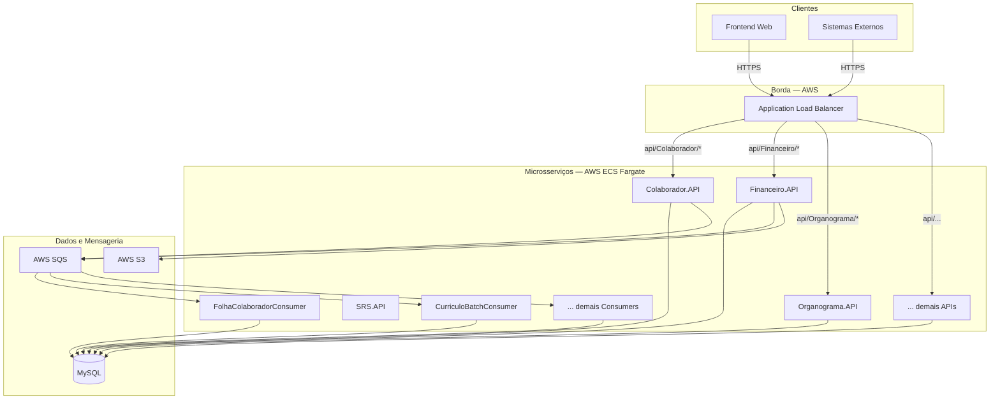

---

## 2. Stack de Tecnologias

| Categoria | Tecnologia | Papel |
|-----------|-----------|-------|
| **Runtime** | .NET 8 / C# | Plataforma de desenvolvimento |
| **API** | ASP.NET Core | Framework para serviços HTTP REST |
| **ORM / Acesso a dados** | Dapper | Mapeamento objeto-relacional leve (padrão atual) |
| **ORM legado** | Entity Framework Core | Usado em projetos antigos; não deve ser replicado |
| **Banco de dados** | MySQL | Banco relacional principal |
| **Migrations** | DbUp | Execução incremental de scripts SQL |
| **Mensageria** | AWS SQS | Filas para processamento assíncrono |
| **Storage** | AWS S3 | Armazenamento de arquivos (fotos, currículos, holerites, etc.) |
| **Containers** | Docker + AWS ECR | Build e registro das imagens |
| **Orquestração** | AWS ECS Fargate | Execução dos containers sem gestão de servidores |
| **Balanceamento** | AWS ALB | Roteamento de requisições HTTP por path |
| **Infraestrutura como Código** | AWS CloudFormation | Provisionamento e atualização de recursos AWS |
| **Segredos** | AWS Secrets Manager | Armazenamento seguro de credenciais e senhas |
| **Cache** | AWS ElastiCache (Valkey) | Cache distribuído |
| **CI/CD** | GitLab CI/CD | Esteira de build, teste e deploy |
| **Logging** | Logs.Infra + Promtail/Loki | Logging estruturado e agregação |
| **Autenticação** | JWT (Bearer Token) | Autenticação stateless em todas as APIs |

---

## 3. Estrutura dos Projetos

O repositório é organizado com um monorepo contendo todos os serviços:

```
colaboracao-backend/
├── ColaboracaoBackend/                 # Código-fonte de todos os serviços
│   │
│   ├── # ── Serviços (APIs)
│   ├── Colaborador.API/
│   ├── Financeiro.API/                 # Referência de padrão ouro
│   ├── Organograma.API/
│   ├── SRS.API/
│   ├── ... (demais APIs)
│   │
│   ├── # ── Serviços (Consumers / Workers)
│   ├── FolhaColaboradorConsumer/
│   ├── CurriculoBatchConsumer/
│   ├── ... (demais Consumers)
│   │
│   ├── # ── Domain e Application por contexto
│   ├── Financeiro.Domain/
│   ├── Financeiro.Application/
│   ├── ... (demais Domain e Application)
│   │
│   ├── # ── Projetos compartilhados (infra interna)
│   ├── Colaboracao.Core/               # Abstrações transversais
│   ├── Colaboracao.Helper/             # Utilitários e extensões
│   ├── Colaboracao.Initializer/        # DI centralizada
│   ├── Colaboracao.Infra/              # Implementações de repositórios (Dapper)
│   ├── DataTransferObject.Domain/      # DTOs compartilhados
│   ├── Core.DomainModel/               # Interfaces de repositório
│   ├── ApiClient.Domain/               # Clients HTTP para APIs externas
│   ├── ApliClient.Infra/               # Implementação genérica de HttpClient
│   ├── Aws.Infra/                      # Integração com AWS (S3, SQS)
│   ├── Logs.Infra/                     # Logging estruturado e interceptores
│   │
│   └── Fourmakers.Core.Migrations/     # Scripts de migração de banco (DbUp)
│
├── Cfn/                                # Templates CloudFormation por serviço
│   ├── projects.json                   # Catálogo de projetos implantáveis
│   ├── build-template.py               # Gerador de templates (uso admin)
│   └── {nome-servico}/                 # Templates e scripts por serviço
│
├── Docs/                               # Documentação
├── .gitlab-ci.yml                      # Pipeline CI raiz
├── .gitlab-pipeline.yml                # Stages e triggers globais
├── .gitlab-cd.yml                      # Scripts CD reutilizáveis
└── .gitlab-rules.yml                   # Regras de branch
```

---

## 4. Arquitetura em Camadas

Cada serviço (API) segue uma **arquitetura em camadas inspirada em DDD**, com responsabilidades bem definidas por projeto:

```
┌─────────────────────────────────────────────────────┐
│  [Nome].API                                         │
│  Controllers · Program.cs · rotas HTTP              │
│  Recebe requisições; delega ao Domain; sem lógica   │
└───────────────────────┬─────────────────────────────┘
                        │ usa
┌───────────────────────▼─────────────────────────────┐
│  [Nome].Application                                 │
│  Initializer (IInitializerConfigurator)             │
│  Configura DI: serviços comuns + dependências       │
└───────────────────────┬─────────────────────────────┘
                        │ registra
┌───────────────────────▼─────────────────────────────┐
│  [Nome].Domain                                      │
│  Services · ValidatorServices                       │
│  Regras de negócio; retorna ApiGenericResult<T>     │
└───────────────────────┬─────────────────────────────┘
                        │ depende de interfaces em
┌───────────────────────▼─────────────────────────────┐
│  Core.DomainModel           DataTransferObject.Domain│
│  Interfaces de repositório  DTOs (Input / Result)   │
└───────────────────────┬─────────────────────────────┘
                        │ implementado por
┌───────────────────────▼─────────────────────────────┐
│  Colaboracao.Infra                                  │
│  Repositórios com Dapper · IDBConnection (MySQL)    │
└─────────────────────────────────────────────────────┘
```

### Fluxo de uma requisição HTTP

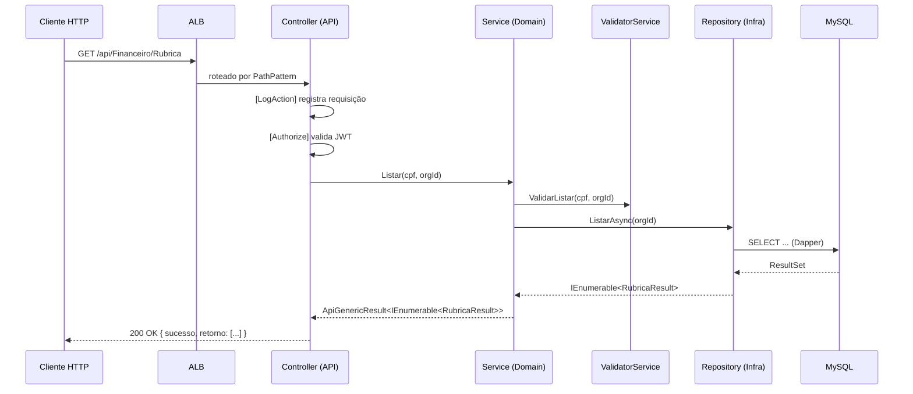

### Responsabilidades por camada

| Camada | Projeto | Responsabilidade |
|--------|---------|-----------------|
| **API** | `*.API` | Roteamento HTTP, autenticação, logging de requisição, repasse ao Domain |
| **Application** | `*.Application` | Configuração de DI (Initializer) |
| **Domain** | `*.Domain` | Regras de negócio, validações, orquestração de repositórios |
| **Contratos** | `Core.DomainModel` | Interfaces de repositório (abstrações) |
| **DTOs** | `DataTransferObject.Domain` | Modelos de entrada (Input) e saída (Result) compartilhados |
| **Infra** | `Colaboracao.Infra` | Implementações de repositório com Dapper e MySQL |
| **DI** | `Colaboracao.Initializer` | Registro centralizado de serviços comuns e por domínio |

---

## 5. Projetos Compartilhados

Esses projetos são referenciados por praticamente todos os serviços e formam a espinha dorsal da plataforma:

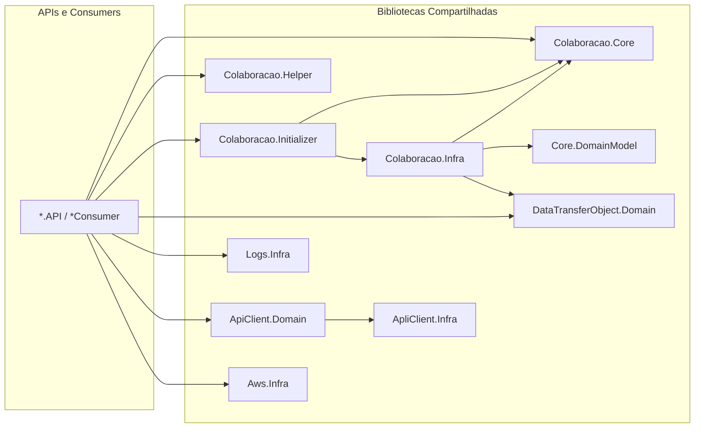

### Papel de cada projeto compartilhado

| Projeto | Papel |
|---------|-------|
| **Colaboracao.Core** | Abstrações transversais: `IAspNetUser` (sessão), `IDBConnection` (Dapper), `IDBConnectionUnitOfWork` (transações), `ILogCore` (log manual), `IUploadFiles` (upload S3), `JWTAuth` (configuração JWT), `HandleExceptionAttribute` (tratamento de erros) |
| **Colaboracao.Helper** | Utilitários: `ExceptionUtil` (gerenciamento padronizado de exceções), `CRUDEnum`, extensões de `String`, `DateTime`, `List`, validações e helpers de cultura |
| **Colaboracao.Initializer** | Configuração centralizada de DI: `AddBaseGeralServicosColaboracao` (JWT, Swagger, CORS), `AddServicosComunsColaboracao` (Dapper, AspNetUser, logs), métodos por domínio (`Add{Contexto}Dependencies`) |
| **Colaboracao.Infra** | Implementações concretas de todos os repositórios usando Dapper e `IDBConnection` |
| **Core.DomainModel** | Interfaces de repositório (`IRepository<T>`, `I{Entidade}Repository`) — contratos entre Domain e Infra |
| **DataTransferObject.Domain** | Todos os DTOs de entrada (`*Input`) e saída (`*Result`), organizados por contexto e recurso; inclui `ApiGenericResult<T>` |
| **ApiClient.Domain** | Interfaces e implementações de clients HTTP para APIs externas; paths em `ClientConfig`; URLs em `EnvironmentVariables` |
| **ApliClient.Infra** | Implementação genérica de `IApiClient` (HttpClient com headers JWT e serialização JSON) |
| **Aws.Infra** | Abstrações e implementações de `IAmazonS3Uploader` (upload de arquivos) e `IQueueProducer` (produção e consumo de filas SQS) |
| **Logs.Infra** | Logging estruturado: `[LogAction]` (interceptor de Controller), `[LogDomainClass]` (interceptor de Service via DispatchProxy), `[LogMasked]` (mascaramento de dados sensíveis), `StructuredLogger` (saída para Promtail) |

---

## 6. Comunicação entre Serviços

### 6.1. Comunicação síncrona — HTTP REST

Serviços se comunicam via HTTP usando a abstração `IApiClient` (ApliClient.Infra). Os clients específicos ficam em **ApiClient.Domain**:

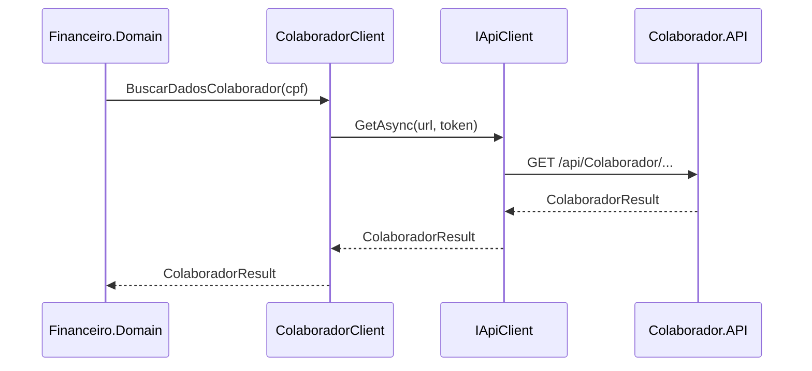

- O token de autenticação é propagado nas chamadas entre serviços.
- Para chamadas de serviço a serviço sem usuário humano, existe um **token de sistema** (`TOKEN_SISTEMA_COLABORACAO`) que autentica a requisição com um usuário "sistema" (CPF `00000000000`, `LoginType = SISTEMA`).

### 6.2. Comunicação assíncrona — AWS SQS

Processamentos demorados ou que não requerem resposta imediata usam filas SQS:

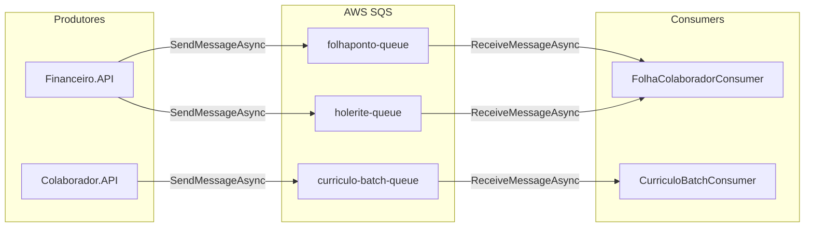

**Consumers** são implementados como `BackgroundService` (.NET Hosted Service), executados como containers independentes no ECS. O ciclo de vida de cada mensagem é:

1. `ReceiveMessageAsync` — obtém mensagem da fila.
2. Processa a mensagem dentro de um escopo de DI isolado.
3. `DeleteMessageAsync` — remove da fila após sucesso.
4. Em erro de validação (`ValidationException`): remove da fila (mensagem inválida).
5. Em erro transiente: **não remove** (retry automático pelo SQS).

---

## 7. Banco de Dados e Migrações

### 7.1. Banco de dados

O banco de dados é **MySQL**, acessado via **Dapper** com a abstração `IDBConnection` (Colaboracao.Core). O padrão de transação usa `IDBConnectionUnitOfWork`, sempre gerenciado na camada de Service.

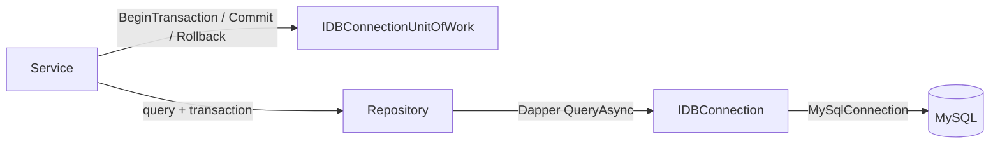

### 7.2. Migrações — Fourmakers.Core.Migrations

Toda alteração de banco (DDL e DML) é executada pela esteira CI/CD via o projeto **`Fourmakers.Core.Migrations`**, que usa a biblioteca **DbUp**:

- Scripts são organizados em `scripts/{ANO}/{MM_Mes}/{DD}/{CARD}/`.
- Cada script é executado **uma única vez** e registrado em `tb_fourmakers_migrations`.
- Suporte a pasta `rollback/` por grupo de scripts para reversão automática em falhas.
- Execução ocorre na etapa `database_migration` da pipeline, antes dos deploys de serviços.

```
scripts/
└── 2026/
    └── 02_Fev/
        └── 10/
            └── 16000/
                ├── 01_create_tb_pedido.sql
                ├── 02_alter_tb_contrato_add_status.sql
                └── rollback/
                    └── 01_rollback_drop_tb_pedido.sql
```

---

## 8. Segurança e Autenticação

### 8.1. Autenticação JWT

Todas as APIs usam **JWT Bearer Token** para autenticação. A configuração é centralizada em `JWTAuth` (Colaboracao.Core), chamada pelo Initializer:

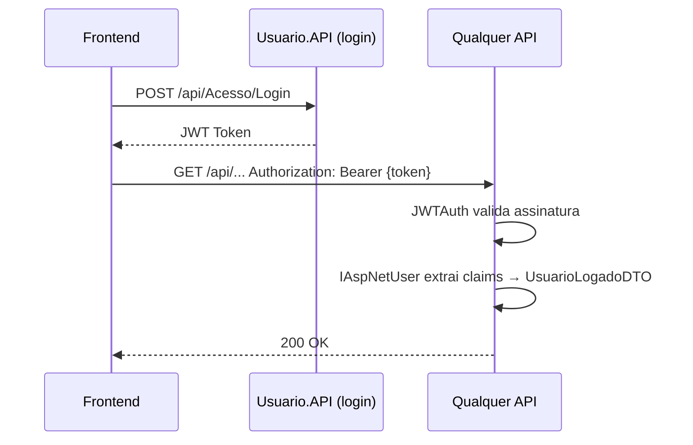

### 8.2. Sessão do usuário

O objeto `UsuarioLogadoDTO` é populado a partir dos **claims do JWT** e está disponível em qualquer Controller ou Service via `IAspNetUser`:

| Campo | Origem no JWT |
|-------|--------------|
| `Cpf` | Claim de CPF |
| `Email` | Claim de e-mail |
| `OrgId` | Claim de organização |
| `CodColaborador` | Claim de código interno |
| `Token` | Token completo (para propagar em chamadas HTTP) |
| `TipoLogin` | `USUARIO` ou `SISTEMA` |

### 8.3. Token de sistema

Para chamadas entre serviços sem usuário humano, existe um token fixo configurado em `TOKEN_SISTEMA_COLABORACAO`. O `JWTAuth` reconhece esse token e injeta claims de sistema (`CPF = 00000000000`, `TipoLogin = SISTEMA`), dispensando autenticação com usuário real.

### 8.4. Segredos e credenciais

Credenciais (senhas de banco, tokens de API externas, chaves de criptografia) são armazenadas no **AWS Secrets Manager** e injetadas nos containers ECS em tempo de execução. Nunca são persistidas em arquivos do repositório.

---

## 9. Observabilidade

### 9.1. Logging estruturado

O projeto utiliza logging automático e estruturado via **Logs.Infra**, alimentando um stack de coleta **Promtail → Loki**:

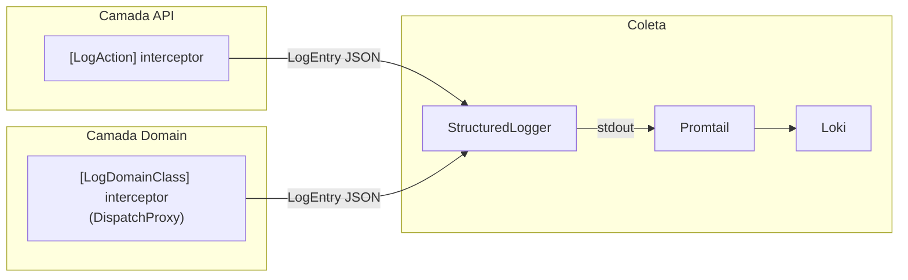

| Mecanismo | Camada | O que registra |
|-----------|--------|---------------|
| `[LogAction]` | Controller | Requisição HTTP: método, rota, parâmetros, claims, status, tempo |
| `[LogDomainClass]` | Service | Chamada de método: parâmetros, tempo, exceções |
| `[LogMasked]` | DTO | Mascara campos sensíveis (senha, token, etc.) antes do log |
| `ILogCore` | Qualquer | Log manual pontual por nível (`Information`, `Error`, etc.) |

### 9.2. Rastreabilidade

Cada requisição carrega dois identificadores propagados por todas as camadas:

- **`X-Trace-Id`**: gerado pelo backend (ou recebido do cliente); identifica a requisição de ponta a ponta.
- **`FRONTEND_TRACE_ID`**: enviado pelo frontend; permite correlacionar logs de frontend e backend na mesma operação.

Ambos são propagados via `TraceIdContext` (AsyncLocal) entre Controller e Service, e devolvidos nos headers da resposta.

### 9.3. Tratamento centralizado de erros

`[HandleExceptionAttribute]` (Colaboracao.Core) captura exceções não tratadas nos Controllers e retorna HTTP padronizado:

| Exceção | HTTP |
|---------|------|
| `ApplicationException` | 400 Bad Request |
| `ArgumentException` | 400 Bad Request |
| `UnauthorizedAccessException` | 401 Unauthorized |
| `AccessViolationException` | 401 Unauthorized |
| Qualquer outra | 500 Internal Server Error |

---

## 10. Infraestrutura AWS

### 10.1. Visão dos recursos AWS

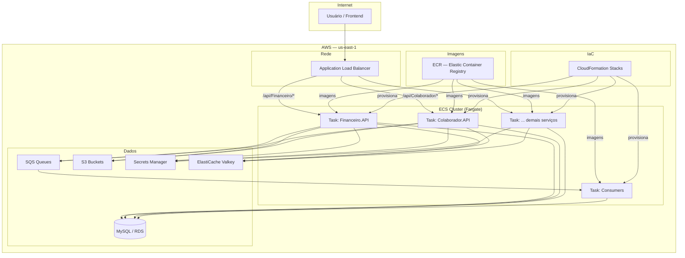

### 10.2. Roteamento pelo ALB

O ALB roteia requisições para os serviços ECS com base no **path pattern**:

| Path Pattern | Serviço ECS |
|-------------|-------------|
| `/api/Financeiro/*` | `srv-financeiro-api` |
| `/api/Colaborador/*` | `srv-colaborador-api` |
| `/api/Organograma/*` | `srv-organograma-api` |
| `/api/{Controller}/*` | `srv-{contexto}-api` |

Cada regra de roteamento é um **CloudFormation Stack** gerenciado pelo template `alb-listener-rule-template.yaml`.

### 10.3. Recursos CloudFormation por serviço

Cada serviço implantável possui três tipos de stack CloudFormation:

| Stack | Template base | O que cria |
|-------|--------------|------------|
| **Task Definition** | `ecs-task-template.yaml` | ECS Task Definition com imagem, CPU, memória, variáveis de ambiente (via Secrets Manager) |
| **Service** | `ecs-service-template.yaml` | ECS Service com desired count, VPC, ALB target group, auto scaling |
| **ALB Listener Rule** | `alb-listener-rule-template.yaml` | Regra de roteamento no ALB (uma por Controller) |

---

## 11. Esteira CI/CD

### 11.1. Estratégia de branches

```
main ──────────────────────────────────────────────── PRD
        ↑ tag vX.Y.Z
develop ───────────────────────────────────────────── DEV (deploy contínuo)
        ↑ merge
feature/* · bugfix/* · hotfix/*                       (sem deploy)
```

| Branch / Evento | Ambiente | Ações |
|-----------------|----------|-------|
| `feature/*`, `bugfix/*` | — | Apenas CI (validação) |
| `develop` | DEV | Migração de banco + build de imagem + deploy ECS |
| Tag `vX.Y.Z` | PRD | Migração de banco + build de imagem + deploy ECS + release GitLab |

### 11.2. Stages da pipeline por serviço

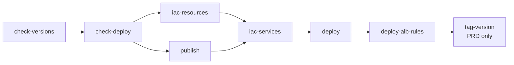

| Stage | O que faz |
|-------|-----------|
| `check-versions` | Compara versão em `projects.json` com variável GitLab; decide se deploy é necessário |
| `check-deploy` | Propaga decisão de deploy para os stages seguintes |
| `iac-resources` | Aplica CloudFormation da Task Definition no AWS |
| `publish` | Build da imagem Docker + push para ECR |
| `iac-services` | Aplica CloudFormation do ECS Service no AWS |
| `deploy` | `aws ecs update-service --force-new-deployment` |
| `deploy-alb-rules` | Aplica CloudFormation das regras do ALB |
| `tag-version` | Registra versão deployada (apenas PRD) |

### 11.3. Arquivos necessários por serviço

| Arquivo | Localização | Função |
|---------|------------|--------|
| `.gitlab-ci.yml` | `ColaboracaoBackend/{Projeto}/` | Etapa CI; dispara CD em `develop` e release |
| `.gitlab-cd.yml` | `ColaboracaoBackend/{Projeto}/` | Define variáveis do projeto e jobs de deploy |
| `Dockerfile` | `ColaboracaoBackend/{Projeto}/` | Build multi-stage da imagem Docker |
| `.dockerignore` | `ColaboracaoBackend/{Projeto}/` | Exclui artefatos do contexto Docker |
| `Cfn/.env` | `ColaboracaoBackend/{Projeto}/Cfn/` | Variáveis de ambiente específicas do projeto |
| Templates CFN | `Cfn/{nome-servico}/` | Gerados pelo `build-template.py` (admin) |
| `projects.json` | `Cfn/` | Catálogo central de serviços implantáveis |

---

## 12. Visão de Implantação

### 12.1. Topologia completa

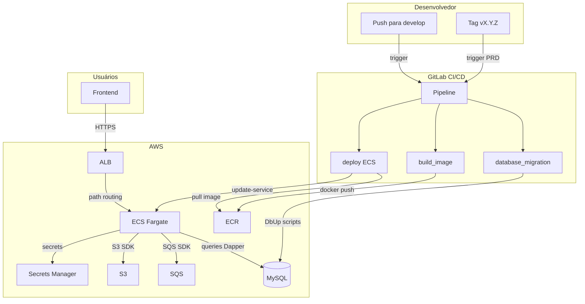

### 12.2. Ambientes

| Ambiente | Branch | ECS Cluster | Banco | ECR Tag |
|----------|--------|-------------|-------|---------|
| **DEV** | `develop` | `ecs` (dev) | `*_dev` / `*_hml` | `{versão}-{data}-{sha}` + `latest` |
| **PRD** | Tag `vX.Y.Z` | `ecs` (prd) | produção | `{versão}-{data}-{sha}` + `latest` |

### 12.3. Variáveis de ambiente nos containers

As variáveis chegam ao container ECS pelo seguinte fluxo:

```
Cfn/.env (raiz — variáveis comuns)
    +
{Projeto}/Cfn/.env (variáveis específicas)
    ↓ build-template.py (admin)
Cfn/{servico}/{servico}-task-{env}.env
    ↓ esteira CI/CD (make)
CloudFormation Task Definition
    ↓ ECS injeta em runtime
Container em execução
    ↓ IConfiguration / variáveis de ambiente
Aplicação .NET
```

Segredos (senhas, tokens sensíveis) são armazenados no **AWS Secrets Manager** e referenciados na Task Definition pelo ARN, nunca em plain text.

---

*Para padrões de implementação, convenções de código e exemplos detalhados, consulte [DIRETRIZES_BACKEND.md](./DIRETRIZES_BACKEND.md).*
