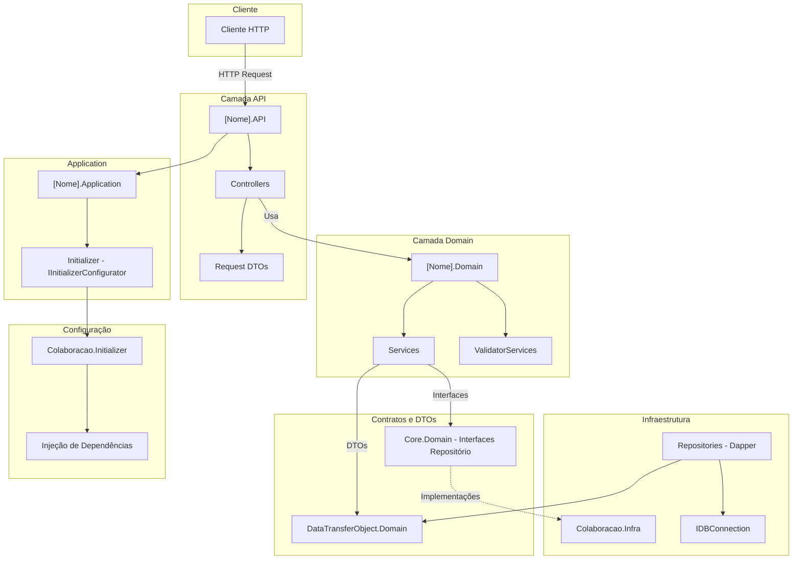

# Diretrizes de Backend - Projeto Colaboração

**Sistema:** Colaboração Backend  
**Data:** 2026-02-19  
**Versão:** 1.0  
**Escopo:** Arquitetura DDD, padrões atuais e guia para novas funcionalidades  
**Base de Dados:** MySQL

---

## ⚠️ AVISOS CRÍTICOS

Este documento contém:
- ✅ **Arquitetura em camadas** (API, Application, Domain, Infra)
- ✅ **Dapper** como padrão para acesso a dados em **novas implementações**
- ✅ **Entity Framework** e **Factory em Models** tratados como **legado** — não replicar
- ✅ **DataTransferObject.Domain** como local de DTOs/Results compartilhados
- ✅ **Colaboracao.Initializer** para configuração centralizada de DI

**LEIA ESPECIALMENTE:**
- Seção 1 (Arquitetura)
- Seção 4 (Camada Infra e Dapper)
- Seção 7 (Padrões legados a não replicar)
- Seção 9 (Autenticação e sessão)
- Seção 10 (Integração HttpClient / ApiClient.Domain)
- Seção 13 (Consumers) e Seção 14 (AWS) quando houver filas ou uso de AWS

---

## 📑 Índice

### Parte I: Arquitetura e Padrões Atuais

1. [Visão Geral da Arquitetura](#1-visão-geral-da-arquitetura) · [1.4 Posicionamento em relação ao DDD](#14-posicionamento-em-relação-ao-ddd)
2. [Camada API](#2-camada-api)
3. [Camada Application e Domain](#3-camada-application-e-domain)
4. [Camada Infra e Dapper](#4-camada-infra-e-dapper)
5. [DTOs e DataTransferObject.Domain](#5-dtos-e-datatransferobjectdomain)
6. [Configuração de DI (Colaboracao.Initializer)](#6-configuração-de-di-colaboracaoinitializer)
7. [Padrões legados a não replicar](#7-padrões-legados-a-não-replicar)
8. [Testes e observabilidade](#8-testes-e-observabilidade)
9. [Autenticação e sessão de usuário](#9-autenticação-e-sessão-de-usuário)
10. [Integração com terceiros (HttpClient)](#10-integração-com-terceiros-httpclient)
11. [Colaboracao.Core](#11-colaboracaocore)
12. [Colaboracao.Helper](#12-colaboracaohelper)
13. [Consumers (filas)](#13-consumers-filas)
14. [Integração AWS (Aws.Infra)](#14-integração-aws-awsinfra)
15. [Gerenciamento de Transações](#15-gerenciamento-de-transações)
16. [Deploy e Esteira CI/CD](#16-deploy-e-esteira-cicd)
17. [Variáveis de Ambiente](#17-variáveis-de-ambiente)
18. [Migrações de Banco de Dados](#18-migrações-de-banco-de-dados)

---

## Parte I: Arquitetura e Padrões Atuais

## 1. Visão Geral da Arquitetura

O projeto segue uma arquitetura em camadas inspirada em DDD: API enxuta, Application com Initializer, Domain com Services e Validators, interfaces de repositório em **Core.Domain** (projeto Core.DomainModel), implementações com **Dapper** em **Colaboracao.Infra**, e DTOs em **DataTransferObject.Domain**.

### 1.1. Diagrama de Arquitetura



### 1.2. Estrutura de Camadas

```
┌─────────────────────────────────────────┐
│            Camada API                   │
│  (Controllers, Program.cs, rotas)      │
└──────────────┬──────────────────────────┘
               │
┌──────────────▼──────────────────────────┐
│     [Nome].Application                 │
│  (Initializer - ConfigureServices)      │
└──────────────┬──────────────────────────┘
               │
┌──────────────▼──────────────────────────┐
│         Camada Domain                   │
│  (Services, ValidatorServices)          │
└──────────────┬──────────────────────────┘
               │
┌──────────────▼──────────────────────────┐
│  Core.Domain / DataTransferObject.Domain│
│  (Interfaces de repositório, DTOs)      │
└──────────────┬──────────────────────────┘
               │
┌──────────────▼──────────────────────────┐
│         Colaboracao.Infra               │
│  (Repositories com Dapper)              │
└─────────────────────────────────────────┘
```

### 1.3. Princípios Fundamentais

1. **Separação de responsabilidades:** API orquestra; Domain contém regras de negócio; Infra acessa dados.
2. **Inversão de dependência:** Domain depende de interfaces (Core.Domain); Infra implementa.
3. **Dependency Injection:** Todas as dependências injetadas via construtor; configuração no Initializer.
4. **Acesso a dados:** Novas implementações usam **Dapper** e **IDBConnection**; Entity Framework é legado.
5. **DTOs centralizados:** Request/Response e Results em **DataTransferObject.Domain**.
6. **Uma API, um Initializer:** Cada API possui um projeto Application (ex.: `[Nome].Application`) com classe Initializer que implementa `IInitializerConfigurator`.

### 1.4. Posicionamento em relação ao DDD

Este projeto adota uma **arquitetura em camadas inspirada em DDD**, mas não implementa DDD em sua forma canônica (Evans). Entender essa distinção é importante para evitar mal-entendidos conceituais.

**O que é adotado do DDD:**

| Conceito DDD | Como se manifesta aqui |
|---|---|
| **Bounded Contexts** | Cada domínio de negócio tem seu próprio conjunto de projetos (`*.Domain`, `*.Application`, `*.API`) |
| **Ubiquitous Language** | Nomenclatura de classes, métodos e DTOs reflete a linguagem do negócio dentro de cada contexto |
| **Repository Pattern** | Interfaces de repositório abstraem o acesso a dados; Domain não conhece Dapper ou SQL |
| **Dependency Inversion** | Domain depende de interfaces (Core.DomainModel); implementações ficam na Infra |
| **Separação entre Application e Domain** | Application é responsável por DI/configuração; Domain contém as regras de negócio |

**O que NÃO é adotado (e por quê):**

| Conceito DDD canônico | Status | Decisão arquitetural |
|---|---|---|
| **Aggregates e Aggregate Roots** | ❌ Não implementado | Complexidade não justificada para o perfil do sistema (CRUD orientado a dados) |
| **Entities e Value Objects ricos** | ❌ Não implementado | Dados trafegam como DTOs; sem modelos de domínio com comportamento |
| **Domain Events** | ❌ Não implementado | Integração assíncrona feita via filas SQS, sem evento de domínio formal |
| **Aggregate Repositories** | ❌ Não implementado | Repositórios operam sobre DTOs/casos de uso, não sobre Aggregate Roots |

> **Nota importante sobre a camada "Domain":** O que este projeto denomina camada **Domain** (os projetos `*.Domain` com `*Service` e `*ValidatorService`) corresponde, na terminologia DDD estrita, a uma **Application Service Layer** — serviços que orquestram casos de uso, validações e acesso a repositórios. Não há um modelo de domínio rico (com Aggregates, Entities e Value Objects) subjacente a esses serviços. Essa é uma escolha consciente e adequada ao contexto do sistema.

**Consequência prática:** ao criar novas funcionalidades, **não tente introduzir** Aggregates, Domain Events ou outros padrões DDD avançados de forma isolada. Mantenha o padrão estabelecido: `Service` + `ValidatorService` + `Repository` + DTOs em `DataTransferObject.Domain`.

---

## 2. Camada API

### 2.1. Responsabilidades

- Receber requisições HTTP e rotear para os serviços do Domain.
- Validar entrada (DTOs de request).
- Obter usuário/contexto (ex.: `IAspNetUser`, `UsuarioLogadoDTO`) e repassar ao Domain quando necessário.
- Retornar respostas HTTP (tipicamente `Ok(result)` com DTOs de **DataTransferObject.Domain**).
- Não conter lógica de negócio.

### 2.2. Estrutura da API

```
[Nome].API/
├── Controllers/
│   ├── {Contexto}/
│   │   ├── {Recurso}Controller.cs
│   │   ├── {Recurso}RelacionadoController.cs
│   │   └── ...
│   └── ...
├── Program.cs
├── appsettings.json
└── Properties/
```

### 2.3. Program.cs

O ponto de entrada deve ser mínimo: cultura, builder e uso do **ApplicationConfigurator** com o **Initializer** da aplicação.

```csharp
using System.Globalization;
using Colaboracao.Initializer.Initializer.Core.Base;

var cultureInfo = new CultureInfo("pt-BR");
CultureInfo.DefaultThreadCurrentCulture = cultureInfo;
CultureInfo.DefaultThreadCurrentUICulture = cultureInfo;

var builder = WebApplication.CreateBuilder(args);
var appName = Assembly.GetExecutingAssembly().GetName().Name;
var initializer = new NomeDaApi.Application.Initializer(); // ex.: Gestao.Application.Initializer

var app = ApplicationConfigurator.ConfigureApplication(builder, appName, initializer);

app.Run();
```

### 2.4. Exemplo de Controller

```csharp
using Colaboracao.Core;
using Colaboracao.Core.Interfaces;
using DataTransferObject.Domain.Gestao.Contrato;
using DataTransferObject.Domain.Usuario;
using Gestao.Domain.Interfaces.Contrato;
using Microsoft.AspNetCore.Authorization;
using Microsoft.AspNetCore.Mvc;
using Logs.Infra.Attributes;

namespace Gestao.API.Controllers.Contrato
{
    [Authorize]
    [Route("api/Gestao/Contrato")]
    [HandleException]
    [ApiController]
    [LogAction]
    public class ContratoController : ControllerBase
    {
        private readonly IContratoService _contratoService;
        private readonly UsuarioLogadoDTO _usuarioLogado;

        public ContratoController(IContratoService contratoService, IAspNetUser aspNetUser)
        {
            _contratoService = contratoService;
            _usuarioLogado = aspNetUser.GetUsuarioLogado();
        }

        [HttpGet("Listar")]
        public async Task<ActionResult> Listar([FromQuery] bool? somenteAtivos)
        {
            var result = await _contratoService.Listar(
                _usuarioLogado.Cpf, _usuarioLogado.OrgId, somenteAtivos ?? true);
            return Ok(result);
        }

        [HttpGet("ObterPorId")]
        public async Task<ActionResult> ObterPorId(Guid id)
        {
            var result = await _contratoService.ObterPorId(id, _usuarioLogado.Cpf, _usuarioLogado.OrgId);
            return Ok(result);
        }

        [HttpPost("Inserir")]
        public async Task<ActionResult> Inserir([FromBody] ContratoInput param)
        {
            var result = await _contratoService.Inserir(param, _usuarioLogado.Cpf, _usuarioLogado.OrgId);
            return Ok(result);
        }

        [HttpPut("Atualizar")]
        public async Task<ActionResult> Atualizar(Guid id, [FromBody] ContratoInput param)
        {
            var result = await _contratoService.Atualizar(param, id, _usuarioLogado.Cpf, _usuarioLogado.OrgId);
            return Ok(result);
        }

        [HttpDelete("Deletar")]
        public async Task<ActionResult> Deletar(Guid id)
        {
            var result = await _contratoService.Deletar(id, _usuarioLogado.Cpf, _usuarioLogado.OrgId);
            if (!result.Sucesso)
                return NotFound(result);
            return Ok(result);
        }
    }
}
```

**Características:**
- Herda de `ControllerBase`.
- Usa `[Authorize]`, `[HandleException]`, `[LogAction]` conforme padrão do projeto.
- Rota por contexto e recurso: `api/{Contexto}/{Recurso}`.
- Injeção de **Service** do Domain e de **IAspNetUser** para contexto do usuário.
- Retorna resultados do Service (tipicamente `ApiGenericResult<T>` ou DTOs) sem lógica de negócio.

---

## 3. Camada Application e Domain

### 3.1. Application – Initializer

Cada API possui um projeto **Application** com uma classe **Initializer** que implementa `IInitializerConfigurator`. Ela configura serviços comuns e dependências do domínio via métodos de extensão do **Colaboracao.Initializer**.

```csharp
using Colaboracao.Initializer;
using Microsoft.AspNetCore.Builder;
using Microsoft.AspNetCore.Hosting;
using Microsoft.Extensions.Configuration;
using Microsoft.Extensions.DependencyInjection;

namespace Gestao.Application;

public class Initializer : IInitializerConfigurator
{
    public void ConfigureServices(IServiceCollection services, IConfiguration config)
    {
        services.AddBaseGeralServicosColaboracao(config);
        services.AddServicosComunsColaboracao();
        services.AddContratoDependencies();     // domínio Contrato
        services.AddProcessamentoDependencies(); // domínio Processamento
    }

    public void ConfigureAppStandard(IApplicationBuilder app, IWebHostEnvironment env, string projectName)
    {
        app.ConfigureAppStandard(env, projectName);
    }
}
```

### 3.2. Domain – Estrutura

```
[Nome].Domain/
├── Interfaces/
│   ├── {Contexto}/
│   │   ├── {Recurso}/
│   │   │   ├── I{Recurso}Service.cs
│   │   │   └── I{Recurso}ValidatorService.cs
│   │   └── ...
│   └── ...
└── Impl/
    ├── {Contexto}/
    │   ├── {Recurso}/
    │   │   ├── {Recurso}Service.cs
    │   │   └── {Recurso}ValidatorService.cs
    │   └── ...
    └── ...
```

- **Interfaces:** contratos dos serviços e validadores no projeto **Domain** da API (ex.: `[Nome].Domain`).
- **Repositórios:** interfaces no projeto **Core.DomainModel** (namespace **Core.Domain**, ex.: `Core.Domain.{Contexto}.{Recurso}.I{Recurso}Repository`); implementações na Infra.

### 3.3. Interface de Service

```csharp
// Gestao.Domain/Interfaces/Contrato/IContratoService.cs
using DataTransferObject.Domain.Base;
using DataTransferObject.Domain.Gestao.Contrato;

namespace Gestao.Domain.Interfaces.Contrato
{
    public interface IContratoService
    {
        Task<ApiGenericResult<IEnumerable<ContratoResult>>> Listar(string cpf, int orgId, bool somenteAtivos = true);
        Task<ApiGenericResult<ContratoResult>> ObterPorId(Guid id, string cpf, int orgId);
        Task<ApiGenericResult<ContratoResult>> Inserir(ContratoInput input, string cpf, int orgId);
        Task<ApiGenericResult<ContratoResult>> Atualizar(ContratoInput input, Guid id, string cpf, int orgId);
        Task<ApiGenericResult> Deletar(Guid id, string cpf, int orgId);
    }
}
```

### 3.4. Service

O Service depende de repositórios (interfaces do Core.Domain), validadores e, se necessário, de **IDBConnectionUnitOfWork** para transações. Retorna **ApiGenericResult&lt;T&gt;** ou **ApiGenericResult** do **DataTransferObject.Domain.Base**.

```csharp
using Colaboracao.Core.Interfaces;
using Colaboracao.Helper.Enum;
using Core.Domain.Gestao.Contrato;
using DataTransferObject.Domain.Base;
using DataTransferObject.Domain.Gestao.Contrato;
using Gestao.Domain.Interfaces.Contrato;

namespace Gestao.Domain.Impl.Contrato
{
    [LogDomainClass]
    public class ContratoService : IContratoService
    {
        public static readonly string DESCRICAO_ENTIDADE = "Contrato";

        private readonly IContratoRepository _repository;
        private readonly IContratoValidatorService _validatorService;
        private readonly IDBConnectionUnitOfWork _dbConnectionUnitOfWork;

        public ContratoService(
            IContratoRepository repository,
            IContratoValidatorService validatorService,
            IDBConnectionUnitOfWork dbConnectionUnitOfWork)
        {
            _repository = repository;
            _validatorService = validatorService;
            _dbConnectionUnitOfWork = dbConnectionUnitOfWork;
        }

        public async Task<ApiGenericResult<IEnumerable<ContratoResult>>> Listar(
            string cpf, int orgId, bool somenteAtivos = true)
        {
            var resultado = new ApiGenericResult<IEnumerable<ContratoResult>>();
            try
            {
                _validatorService.ValidarAcesso(cpf, orgId);
                resultado.Retorno = await _repository.ListarAsync(orgId, somenteAtivos);
            }
            catch (Exception ex)
            {
                ExceptionUtil.GerenciarRetornoExcecao(ex, CRUDEnum.Read, DESCRICAO_ENTIDADE);
            }
            return resultado;
        }

        public async Task<ApiGenericResult<ContratoResult>> Inserir(
            ContratoInput input, string cpf, int orgId)
        {
            var resultado = new ApiGenericResult<ContratoResult>();
            try
            {
                _validatorService.ValidarAcesso(cpf, orgId);
                _validatorService.ValidarInput(input);

                var existente = await _repository.ObterPorCodigoAsync(input.Codigo, orgId);
                if (existente != null)
                    throw new ArgumentException($"Já existe um {DESCRICAO_ENTIDADE} com o código informado.");

                resultado.Retorno = await _repository.InserirAsync(input, cpf, orgId);
            }
            catch (Exception ex)
            {
                ExceptionUtil.GerenciarRetornoExcecao(ex, CRUDEnum.Create, DESCRICAO_ENTIDADE);
            }
            return resultado;
        }

        public async Task<ApiGenericResult> Deletar(Guid id, string cpf, int orgId)
        {
            var resultado = new ApiGenericResult();
            try
            {
                _validatorService.ValidarAcesso(cpf, orgId);
                var excluido = await _repository.DeletarAsync(id);
                if (!excluido)
                    ExceptionUtil.NaoExcluido(DESCRICAO_ENTIDADE);
            }
            catch (Exception ex)
            {
                ExceptionUtil.GerenciarRetornoExcecao(ex, CRUDEnum.Delete, DESCRICAO_ENTIDADE);
            }
            return resultado;
        }
        // ...outros métodos
    }
}
```

### 3.5. ValidatorService

Regras de validação de acesso e integridade de dados ficam em um **ValidatorService** dedicado:

```csharp
// Gestao.Domain/Interfaces/Contrato/IContratoValidatorService.cs
using DataTransferObject.Domain.Gestao.Contrato;

namespace Gestao.Domain.Interfaces.Contrato
{
    public interface IContratoValidatorService
    {
        void ValidarAcesso(string cpf, int orgId);
        void ValidarInput(ContratoInput input);
    }
}
```

```csharp
// Gestao.Domain/Impl/Contrato/ContratoValidatorService.cs
using Colaboracao.Core.Interfaces;
using Core.Domain.Usuario.Permissao;
using DataTransferObject.Domain.Gestao.Contrato;
using Gestao.Domain.Interfaces.Contrato;

namespace Gestao.Domain.Impl.Contrato
{
    public class ContratoValidatorService : IContratoValidatorService
    {
        private readonly IFuncionalidadeSistemaRepository _funcionalidadeRepository;

        public ContratoValidatorService(IFuncionalidadeSistemaRepository funcionalidadeRepository)
        {
            _funcionalidadeRepository = funcionalidadeRepository;
        }

        public void ValidarAcesso(string cpf, int orgId)
        {
            var temAcesso = _funcionalidadeRepository.ValidarAcessoFuncionalidade(cpf, orgId);
            if (!temAcesso)
                throw new UnauthorizedAccessException("Usuário sem permissão para acessar Contrato.");
        }

        public void ValidarInput(ContratoInput input)
        {
            if (string.IsNullOrWhiteSpace(input.Codigo))
                throw new ArgumentException("Código do contrato é obrigatório.");
            if (string.IsNullOrWhiteSpace(input.Descricao))
                throw new ArgumentException("Descrição do contrato é obrigatória.");
        }
    }
}
```

**Regras:**
- **Não** usar Factory para criar "models" (ver seção 7).
- Repositórios retornam DTOs/Results do **DataTransferObject.Domain**.
- Validações de negócio no Service ou em **ValidatorService** dedicado.
- Uso de **ExceptionUtil** e **ApiGenericResult** conforme padrão do projeto.

---

## 4. Camada Infra e Dapper

### 4.1. Acesso a dados: Dapper como padrão

- **Novas implementações** devem usar **Dapper** e **IDBConnection** (ou **IDBConnectionUnitOfWork** quando houver transação).
- **Entity Framework** existe em partes do sistema (ex.: `ColaboradorContext`) e é considerado **legado**. Não criar novos DbContexts ou novos fluxos baseados em EF; preferir Dapper.

### 4.2. IDBConnection

A abstração de conexão está em **Colaboracao.Core.Interfaces**:

```csharp
public interface IDBConnection
{
    MySqlConnection GetConnection();
    IDbTransaction GetTransaction();
    void SetTransaction(IDbTransaction transaction);
    void NewConnection();
}
```

Os repositórios recebem **IDBConnection** pelo construtor e obtêm a conexão com `GetConnection()` para executar queries Dapper.

### 4.3. Estrutura dos repositórios (Infra)

```
Colaboracao.Infra/
├── Repositories/
│   ├── {Contexto}/
│   │   ├── {Recurso}/
│   │   │   ├── {Recurso}Repository.cs
│   │   │   └── ...
│   │   └── ...
│   └── ...
└── Context/   (legado, quando existir)
```

### 4.4. Interface de repositório (Core.Domain)

```csharp
// Core.DomainModel/Gestao/Contrato/IContratoRepository.cs
using DataTransferObject.Domain.Gestao.Contrato;

namespace Core.Domain.Gestao.Contrato
{
    public interface IContratoRepository
    {
        Task<IEnumerable<ContratoResult>> ListarAsync(int orgId, bool somenteAtivos = true);
        Task<ContratoResult?> ObterPorIdAsync(Guid id);
        Task<ContratoResult?> ObterPorCodigoAsync(string codigo, int orgId);
        Task<ContratoResult> InserirAsync(ContratoInput input, string cpf, int orgId);
        Task<ContratoResult> AtualizarAsync(ContratoInput input, Guid id, string cpf, int orgId);
        Task<bool> DeletarAsync(Guid id);
    }
}
```

### 4.5. Exemplo de repositório com Dapper

```csharp
using Colaboracao.Core.Interfaces;
using Core.Domain.Gestao.Contrato;
using Dapper;
using DataTransferObject.Domain.Gestao.Contrato;

namespace Colaboracao.Infra.Repositories.Gestao.Contrato
{
    public class ContratoRepository : IContratoRepository
    {
        private readonly IDBConnection _dapperConnection;

        public ContratoRepository(IDBConnection dapperConnection)
        {
            _dapperConnection = dapperConnection;
        }

        private string SELECT_DEFAULT => @"
            SELECT
                c.id AS Id,
                c.tb_org_id AS OrgId,
                c.codigo AS Codigo,
                c.descricao AS Descricao,
                c.ativo AS Ativo,
                c.data_criacao AS DataCriacao,
                c.data_alteracao AS DataAlteracao
            FROM tb_contrato c
            WHERE c.ativo = 1";

        public async Task<IEnumerable<ContratoResult>> ListarAsync(int orgId, bool somenteAtivos = true)
        {
            var connection = _dapperConnection.GetConnection();
            var query = SELECT_DEFAULT + " AND c.tb_org_id = @OrgId";
            if (!somenteAtivos)
                query = query.Replace("WHERE c.ativo = 1", "WHERE 1=1");

            return await connection.QueryAsync<ContratoResult>(query, new { OrgId = orgId });
        }

        public async Task<ContratoResult?> ObterPorIdAsync(Guid id)
        {
            var connection = _dapperConnection.GetConnection();
            var query = SELECT_DEFAULT + " AND c.id = @Id";
            return await connection.QueryFirstOrDefaultAsync<ContratoResult>(query, new { Id = id });
        }

        public async Task<ContratoResult> InserirAsync(ContratoInput input, string cpf, int orgId)
        {
            var connection = _dapperConnection.GetConnection();
            var query = @"
                INSERT INTO tb_contrato
                    (id, tb_org_id, codigo, descricao, ativo, data_criacao, cpf_criacao)
                VALUES
                    (UUID(), @OrgId, @Codigo, @Descricao, 1, NOW(), @Cpf);
                SELECT LAST_INSERT_ID() AS Id;";

            // Usar ObterPorCodigoAsync para retornar o registro completo após inserção
            await connection.ExecuteAsync(query, new
            {
                OrgId = orgId,
                input.Codigo,
                input.Descricao,
                Cpf = cpf
            });

            return await ObterPorCodigoAsync(input.Codigo, orgId);
        }

        public async Task<bool> DeletarAsync(Guid id)
        {
            var connection = _dapperConnection.GetConnection();
            var query = "UPDATE tb_contrato SET ativo = 0 WHERE id = @Id";
            var linhasAfetadas = await connection.ExecuteAsync(query, new { Id = id });
            return linhasAfetadas > 0;
        }

        public async Task<ContratoResult?> ObterPorCodigoAsync(string codigo, int orgId)
        {
            var connection = _dapperConnection.GetConnection();
            var query = SELECT_DEFAULT + " AND c.codigo = @Codigo AND c.tb_org_id = @OrgId";
            return await connection.QueryFirstOrDefaultAsync<ContratoResult>(query, new { Codigo = codigo, OrgId = orgId });
        }

        // AtualizarAsync segue o mesmo padrão...
        public async Task<ContratoResult> AtualizarAsync(ContratoInput input, Guid id, string cpf, int orgId)
        {
            var connection = _dapperConnection.GetConnection();
            var query = @"
                UPDATE tb_contrato
                SET descricao = @Descricao, data_alteracao = NOW(), cpf_alteracao = @Cpf
                WHERE id = @Id AND tb_org_id = @OrgId";
            await connection.ExecuteAsync(query, new { input.Descricao, Cpf = cpf, Id = id, OrgId = orgId });
            return await ObterPorIdAsync(id);
        }
    }
}
```

**Características:**
- Implementa interface definida em **Core.Domain**.
- Usa **Dapper** (`QueryAsync`, `QueryFirstOrDefaultAsync`, `ExecuteAsync`, etc.).
- Retorna tipos de **DataTransferObject.Domain** (ex.: `ContratoResult`).
- SQL com aliases em PascalCase para mapeamento direto nas propriedades do DTO.

### 4.6. Transações

Para operações que exigem que múltiplas escritas sejam atômicas, usar **IDBConnectionUnitOfWork** no Service. A transação é iniciada no Service e passada aos repositórios quando necessário.

```csharp
// Exemplo: criar dois registros de forma atômica dentro do Service
public async Task<ApiGenericResult<PedidoResult>> CriarPedidoComItens(
    PedidoInput input, string cpf, int orgId)
{
    var resultado = new ApiGenericResult<PedidoResult>();
    try
    {
        _validatorService.ValidarInput(input);

        _dbConnectionUnitOfWork.BeginTransaction();
        try
        {
            var pedido = await _pedidoRepository.InserirAsync(input, cpf, orgId, _dbConnectionUnitOfWork.Transaction);
            foreach (var item in input.Itens)
                await _itemPedidoRepository.InserirAsync(item, pedido.Id, _dbConnectionUnitOfWork.Transaction);

            _dbConnectionUnitOfWork.Commit();
            resultado.Retorno = pedido;
        }
        catch
        {
            _dbConnectionUnitOfWork.Rollback();
            throw;
        }
    }
    catch (Exception ex)
    {
        ExceptionUtil.GerenciarRetornoExcecao(ex, CRUDEnum.Create, "Pedido");
    }
    return resultado;
}
```

**Diretrizes:**
- Transações no **Service**, não no repositório.
- Repositórios aceitam `IDbTransaction?` opcional para participar de transações externas.
- Usar `Rollback` explícito em caso de exceção; o `Commit` apenas após sucesso de todas as operações.

---

## 5. DTOs e DataTransferObject.Domain

### 5.1. Localização

- **Request (input):** em **DataTransferObject.Domain** por contexto e recurso (ex.: `DataTransferObject.Domain.{Contexto}.{Recurso}.{Recurso}Input`).
- **Response / Result:** em **DataTransferObject.Domain** (ex.: `{Recurso}Result`).
- **Base compartilhada:** classes base quando fizer sentido (ex.: `{Recurso}Base`).

**Não** criar DTOs/Results duplicados no Domain ou na API; reutilizar ou estender em **DataTransferObject.Domain**.

### 5.2. Padrão de resultado da API

O projeto usa **ApiGenericResult&lt;T&gt;** para encapsular retorno e status:

```csharp
// DataTransferObject.Domain.Base
public class ApiGenericResult<T> : StatusResult
{
    public T Retorno { get; set; }
}
```

Os Services retornam `ApiGenericResult<T>` ou `ApiGenericResult`; os Controllers retornam `Ok(result)` com esse objeto.

### 5.3. Exemplo: DTO Base, Input e Result

```csharp
// DataTransferObject.Domain/Gestao/Contrato/ContratoBase.cs
namespace DataTransferObject.Domain.Gestao.Contrato
{
    public class ContratoBase
    {
        public string Codigo { get; set; }
        public string Descricao { get; set; }
        public int OrgId { get; set; }
        public bool Ativo { get; set; }
    }
}

// DataTransferObject.Domain/Gestao/Contrato/ContratoInput.cs
namespace DataTransferObject.Domain.Gestao.Contrato
{
    // DTO de entrada (request body): apenas os campos editáveis pelo usuário
    public class ContratoInput
    {
        public string Codigo { get; set; }
        public string Descricao { get; set; }
    }
}

// DataTransferObject.Domain/Gestao/Contrato/ContratoResult.cs
namespace DataTransferObject.Domain.Gestao.Contrato
{
    // DTO de saída (response): herda os campos base e acrescenta metadados
    public class ContratoResult : ContratoBase
    {
        public Guid Id { get; set; }
        public DateTime DataCriacao { get; set; }
        public DateTime DataAlteracao { get; set; }
    }
}
```

- Preferir **classes** conforme o padrão já utilizado no módulo; manter consistência com o restante do **DataTransferObject.Domain**.
- **Input** contém apenas campos que o usuário pode enviar. **Result** herda a base e adiciona campos gerados pelo sistema (Id, datas, etc.).

---

## 6. Configuração de DI (Colaboracao.Initializer)

### 6.1. Papel do Initializer

- **Colaboracao.Initializer** expõe métodos de extensão que registram serviços comuns (base, DB, cache, JWT, etc.) e, por domínio, repositórios, services e validators.
- Cada **API** usa um **Application** que chama esses métodos no `Initializer.ConfigureServices`.

### 6.2. Base e comuns

- `AddBaseGeralServicosColaboracao(config)`: configuração base (JWT, contexto legado se existir, cache, localização, health checks).
- `AddServicosComunsColaboracao()`: serviços transversais (log, AspNetUser, DBConnection, clientes, etc.).

### 6.3. Registro por domínio

No **Colaboracao.Initializer**, criar métodos de extensão por contexto (ex.: `Initializer.Core.Entities.InitializerContrato.Core.cs`):

```csharp
using Colaboracao.Infra.Repositories.Gestao.Contrato;
using Core.Domain.Gestao.Contrato;
using Gestao.Domain.Impl.Contrato;
using Gestao.Domain.Interfaces.Contrato;
using Microsoft.Extensions.DependencyInjection;
using Microsoft.Extensions.DependencyInjection.Extensions;

namespace Colaboracao.Initializer
{
    public static partial class InitializerExtension
    {
        public static void AddContratoDependencies(this IServiceCollection services)
        {
            // Service
            services.TryAddScopedDomainService<IContratoService, ContratoService>();

            // Validator
            services.TryAddScoped<IContratoValidatorService, ContratoValidatorService>();

            // Repositório: interface em Core.Domain, implementação em Colaboracao.Infra
            services.TryAddScoped<IContratoRepository, ContratoRepository>();
        }
    }
}
```

- **Repositórios:** interface em **Core.Domain**, implementação em **Colaboracao.Infra**.
- **Services e Validators:** interface e implementação no projeto **Domain** da API (ex.: `[Nome].Domain`).

---

## 7. Padrões legados a não replicar

### 7.1. Factory em Models

Em projetos legados existe o padrão de **Factory** para "models":

- Interfaces como `I{Entidade}DomainFactory` que expõem métodos do tipo `build{Entidade}Model()`.
- Models que recebem `IRepository<TModel, TFactory>` e chamam a factory para obter instâncias ou delegar operações.
- Lógica de negócio e acesso a dados acoplados ao model e à factory.

**Diretriz:** Este padrão é **legado**. Em **novas funcionalidades** não utilizar:

- Factory para construção de "models" no Domain.
- Models que dependem de repositórios e factories e concentram regras de negócio.

#### ❌ Padrão legado — não replicar

```csharp
// LEGADO: model com lógica de negócio e dependência de factory
public class ContratoModel : IContratoModel
{
    private readonly IRepository<IContratoModel, IContratoDomainFactory> _repository;

    public ContratoModel(ILogCore log, IUnitOfWork unitOfWork,
        IRepository<IContratoModel, IContratoDomainFactory> repository)
    {
        _repository = repository;
    }

    public IContratoModel ObterPorCodigo(string codigo, IContratoDomainFactory factory)
    {
        // Acessa banco dentro do model — acoplamento incorreto
        return _repository.GetByCodigo(codigo, factory);
    }
}

// LEGADO: factory que instancia o model
public class ContratoDomainFactory : IContratoDomainFactory
{
    public IContratoModel buildContratoModel() => new ContratoModel(...);
}
```

#### ✅ Padrão atual — seguir

```csharp
// CORRETO: Service recebe interfaces de repositório e retorna DTOs
public class ContratoService : IContratoService
{
    private readonly IContratoRepository _repository;
    private readonly IContratoValidatorService _validatorService;

    public ContratoService(IContratoRepository repository, IContratoValidatorService validatorService)
    {
        _repository = repository;
        _validatorService = validatorService;
    }

    public async Task<ApiGenericResult<ContratoResult>> ObterPorId(Guid id, string cpf, int orgId)
    {
        var resultado = new ApiGenericResult<ContratoResult>();
        try
        {
            _validatorService.ValidarAcesso(cpf, orgId);
            var contrato = await _repository.ObterPorIdAsync(id);
            if (contrato == null) ExceptionUtil.NaoEncontrado("Contrato");
            resultado.Retorno = contrato;
        }
        catch (Exception ex) { ExceptionUtil.GerenciarRetornoExcecao(ex, CRUDEnum.Read, "Contrato"); }
        return resultado;
    }
}
```

### 7.2. Entity Framework em novas implementações

- **EF** ainda é usado em partes do sistema (ex.: `ColaboradorContext` em `AddDBGColbColaboracaoContext`). Isso é **legado**.
- **Novas implementações** devem usar **Dapper** e **IDBConnection** (e **IDBConnectionUnitOfWork** quando houver transação).
- Não criar novos DbContexts ou novos fluxos baseados em EF; manter EF apenas onde já existir e for necessário.

### 7.3. Resumo

| Prática                             | Status | Ação em novas funcionalidades       |
|-------------------------------------|--------|-------------------------------------|
| Dapper + IDBConnection              | Padrão | Usar em novos repositórios          |
| Services + Core.Domain interfaces   | Padrão | Seguir                              |
| DataTransferObject.Domain para DTOs | Padrão | Centralizar requests/results        |
| Factory em Models                   | Legado | Não replicar                        |
| Entity Framework                    | Legado | Não usar em novas implementações    |

---

## 8. Testes e observabilidade

### 8.1. Testes

- Cobrir a **lógica de negócio** nos Services com testes unitários, mockando repositórios e dependências externas.
- Manter Domain testável: dependências apenas por interfaces (Core.Domain, etc.).

#### Exemplo de teste unitário de Service

```csharp
using Moq;
using Xunit;
using Core.Domain.Gestao.Contrato;
using DataTransferObject.Domain.Gestao.Contrato;
using Gestao.Domain.Impl.Contrato;
using Gestao.Domain.Interfaces.Contrato;
using Colaboracao.Core.Interfaces;

public class ContratoServiceTestes
{
    private readonly Mock<IContratoRepository> _repositoryMock;
    private readonly Mock<IContratoValidatorService> _validatorMock;
    private readonly Mock<IDBConnectionUnitOfWork> _uowMock;
    private readonly ContratoService _service;

    public ContratoServiceTestes()
    {
        _repositoryMock = new Mock<IContratoRepository>();
        _validatorMock = new Mock<IContratoValidatorService>();
        _uowMock = new Mock<IDBConnectionUnitOfWork>();
        _service = new ContratoService(_repositoryMock.Object, _validatorMock.Object, _uowMock.Object);
    }

    [Fact]
    public async Task Listar_ComOrgIdValido_DeveRetornarLista()
    {
        // Arrange
        var orgId = 1;
        var cpf = "12345678901";
        var listaEsperada = new List<ContratoResult>
        {
            new ContratoResult { Id = Guid.NewGuid(), Codigo = "C001", Descricao = "Contrato Teste" }
        };
        _repositoryMock
            .Setup(r => r.ListarAsync(orgId, true))
            .ReturnsAsync(listaEsperada);

        // Act
        var resultado = await _service.Listar(cpf, orgId, true);

        // Assert
        Assert.NotNull(resultado);
        Assert.Single(resultado.Retorno);
        _repositoryMock.Verify(r => r.ListarAsync(orgId, true), Times.Once);
    }

    [Fact]
    public async Task Inserir_ComCodigoJaExistente_DeveLancarExcecao()
    {
        // Arrange
        var cpf = "12345678901";
        var orgId = 1;
        var input = new ContratoInput { Codigo = "C001", Descricao = "Duplicado" };
        _repositoryMock
            .Setup(r => r.ObterPorCodigoAsync(input.Codigo, orgId))
            .ReturnsAsync(new ContratoResult { Codigo = "C001" });

        // Act & Assert
        var resultado = await _service.Inserir(input, cpf, orgId);

        // O ExceptionUtil rethrow como Exception, então o resultado não terá Retorno
        Assert.Null(resultado.Retorno);
    }
}
```

### 8.2. Observabilidade e Logging

O projeto utiliza logging **estruturado e automático** via o projeto **Logs.Infra**, integrado ao pipeline de coleta do **Promtail/Loki**. Existem três mecanismos complementares de log e um mecanismo de tratamento centralizado de erros.

#### Visão geral dos mecanismos

| Mecanismo | Camada | O que registra |
|-----------|--------|---------------|
| `[LogAction]` | API (Controller) | Toda requisição HTTP: método, rota, parâmetros, claims, status code, tempo de execução |
| `[LogDomainClass]` | Domain (Service) | Toda chamada de método público dos Services: parâmetros, tempo de execução, exceções |
| `ILogCore` | Qualquer | Log manual pontual com nível escolhido pelo desenvolvedor |
| `[HandleException]` | API (Controller) | Captura exceções não tratadas e retorna HTTP padronizado |

---

#### 8.2.1. `[LogAction]` — log automático da camada API

Aplicado na **classe** do Controller (não em métodos individualmente). Intercepta toda ação via `IAsyncActionFilter`:

- Captura o `X-Trace-Id` do header de requisição (ou gera um novo) e propaga para o response.
- Captura o `FRONTEND_TRACE_ID` e propaga para a camada Domain via `TraceIdContext` (contexto assíncrono).
- Registra: projeto, classe, método, parâmetros serializados em JSON (com mascaramento automático de dados sensíveis), claims do JWT, HTTP method, path, status code e tempo de execução em ms.

```csharp
using Logs.Infra.Attributes;

[ApiController]
[Route("api/[controller]")]
[Authorize]
[HandleException]
[LogAction]                          // ← aplicar na classe, cobre todos os métodos
public class PedidoController : ControllerBase
{
    [HttpGet]
    public async Task<IActionResult> Listar() { ... }

    [HttpPost]
    public async Task<IActionResult> Criar([FromBody] PedidoInput input) { ... }
}
```

---

#### 8.2.2. `[LogDomainClass]` — log automático da camada Domain

Aplicado na **classe de implementação** do Service. Funciona via **DispatchProxy** (`LogDomainInterceptor<T>`): ao registrar o Service com `AddScopedDomainService`, o Initializer detecta o atributo e cria um proxy que intercepta todos os métodos públicos automaticamente.

- Usa o `TraceId` propagado pelo `[LogAction]` via `TraceIdContext`, ligando logs de API e Domain na mesma rastreabilidade.
- Registra: projeto (assembly), classe, método, parâmetros serializados com mascaramento, tempo de execução, mensagem e stack trace de exceção.

```csharp
using Logs.Infra.Attributes;

[LogDomainClass]                     // ← todos os métodos públicos serão interceptados
public class PedidoService : IPedidoService
{
    // Nenhum código adicional de log é necessário; o proxy cuida disso
    public async Task<ApiGenericResult<IEnumerable<PedidoResult>>> Listar(string cpf, int orgId) { ... }
    public async Task<ApiGenericResult<PedidoResult>> Inserir(PedidoInput input, string cpf, int orgId) { ... }
}
```

> **Importante:** o proxy só é criado quando o registro é feito com `AddScopedDomainService` (ou `TryAddScopedDomainService`). O `AddScoped` comum **ignora** o atributo e não cria o interceptor.

```csharp
// Colaboracao.Initializer — registro correto para ativar o interceptor de log
services.AddScopedDomainService<IPedidoService, PedidoService>();

// ❌ Assim o atributo [LogDomainClass] é ignorado:
// services.AddScoped<IPedidoService, PedidoService>();
```

---

#### 8.2.3. `[LogMasked]` — mascaramento de dados sensíveis

Propriedades de DTOs que passam como parâmetro para Controllers ou Services podem conter dados sensíveis. O `[LogMasked]` instrui o `LogMaskingHelper` a substituir o valor por `"***"` antes de serializar para o log.

O helper também mascara automaticamente propriedades cujo nome contenha `senha`, `password`, `token`, `secret`, `key`, `credential` ou `auth` (case-insensitive), mesmo sem o atributo.

```csharp
// DataTransferObject.Domain/Acesso/Login/LoginInput.cs
using Logs.Infra.Attributes;

public class LoginInput
{
    public string Cpf { get; set; }

    [LogMasked]                      // ← valor nunca aparece nos logs
    public string Senha { get; set; }
}
```

---

#### 8.2.4. `ILogCore` — log manual pontual

Para situações em que o log automático não é suficiente (ex.: registrar uma decisão de negócio, logar resultado de uma validação intermediária), injete `ILogCore` no Service ou repositório e chame `Log(mensagem, nível)`.

```csharp
using Colaboracao.Core;
using DataTransferObject.Domain.Log;

public class PedidoService : IPedidoService
{
    private readonly IPedidoRepository _repository;
    private readonly ILogCore _log;

    public PedidoService(IPedidoRepository repository, ILogCore log)
    {
        _repository = repository;
        _log = log;
    }

    public async Task<ApiGenericResult<PedidoResult>> Inserir(PedidoInput input, string cpf, int orgId)
    {
        var resultado = new ApiGenericResult<PedidoResult>();
        try
        {
            _log.Log($"Iniciando criação de pedido para CPF {cpf}, Org {orgId}.", LevelsEnum.Information);

            resultado.Retorno = await _repository.InserirAsync(input, cpf, orgId);

            _log.Log($"Pedido criado com sucesso: {resultado.Retorno?.Id}.", LevelsEnum.Information);
        }
        catch (Exception ex)
        {
            _log.Log($"Erro ao criar pedido: {ex.Message}", LevelsEnum.Error);
            ExceptionUtil.GerenciarRetornoExcecao(ex, CRUDEnum.Create, DESCRICAO_ENTIDADE);
        }
        return resultado;
    }
}
```

Níveis disponíveis em `LevelsEnum`: `Trace`, `Debug`, `Information`, `Warning`, `Error`, `Critical`.

> Em geral, prefira o log automático via `[LogDomainClass]`. Use `ILogCore` apenas para registros **pontuais e contextuais** que o interceptor não capturaria.

---

#### 8.2.5. `[HandleException]` — tratamento centralizado de erros na API

Aplicado na **classe** do Controller junto com `[LogAction]`. Implementa `IAsyncExceptionFilter` e converte exceções não tratadas em respostas HTTP padronizadas com `ApiGenericResult`:

| Exceção | HTTP Status |
|---------|-------------|
| `ApplicationException` | `400 Bad Request` |
| `ArgumentException` | `400 Bad Request` |
| `UnauthorizedAccessException` | `401 Unauthorized` |
| `AccessViolationException` | `401 Unauthorized` |
| Qualquer outra | `500 Internal Server Error` |

```csharp
[ApiController]
[Route("api/[controller]")]
[Authorize]
[HandleException]                    // ← captura exceções e retorna HTTP padronizado
[LogAction]
public class PedidoController : ControllerBase { ... }
```

O `ExceptionUtil` (Colaboracao.Helper) complementa esse mecanismo lançando o tipo correto de exceção no Domain, para que o `[HandleException]` na API retorne o status HTTP adequado:

```csharp
// No Service — lança ApplicationException → [HandleException] retorna 400
ExceptionUtil.NaoEncontrado("Pedido");            // → ApplicationException com msg padronizada
ExceptionUtil.GerenciarRetornoExcecao(ex, ...);  // → relança ou encapsula conforme o tipo
```

---

#### 8.2.6. Rastreabilidade (Trace)

O `[LogAction]` propaga dois identificadores de rastreio entre camadas:

| Header | Descrição |
|--------|-----------|
| `X-Trace-Id` | Gerado pelo backend se ausente; identifica a requisição em todos os logs |
| `FRONTEND_TRACE_ID` | Enviado pelo frontend; permite correlacionar logs de frontend e backend |

Ambos os IDs são devolvidos nos **headers da resposta** e propagados internamente via `TraceIdContext` (AsyncLocal), de modo que os logs do `[LogDomainClass]` na camada Domain também os incluam, permitindo rastrear toda a cadeia de uma requisição.

---

#### 8.2.7. Ambiente e filtragem de logs

O `AddLogsInfra` (chamado pelo Initializer) configura o nível de log conforme a variável de ambiente `AMBIENTE`:

| Ambiente | Comportamento |
|----------|--------------|
| `PRD` / `HML` | Apenas logs estruturados (Logs.Infra) são emitidos; logs padrão do ASP.NET/Microsoft silenciados |
| Outros (DEV, local) | Logs estruturados + logs normais do framework visíveis |

---

#### 8.2.8. Diretrizes de observabilidade

- **Sempre** aplicar `[LogAction]` e `[HandleException]` nos Controllers.
- **Sempre** aplicar `[LogDomainClass]` nas classes de Service e registrá-las com `AddScopedDomainService`.
- **Nunca** registrar um Service com `[LogDomainClass]` usando `AddScoped` simples — o interceptor não será criado.
- Usar `[LogMasked]` em propriedades de DTOs que contenham senhas, tokens ou outros dados sensíveis.
- Usar `ILogCore` apenas para logs **pontuais e contextuais**; evitar usá-lo como substituto do interceptor automático.
- **Não** duplicar código de logging nos métodos quando `[LogDomainClass]` já cobre o caso.
- Garantir que headers `X-Trace-Id` e `FRONTEND_TRACE_ID` sejam propagados nas chamadas entre serviços via `IApiClient`.

---

## 9. Autenticação e sessão de usuário

### 9.1. Visão geral

A autenticação é baseada em **JWT (JSON Web Token)**. A configuração do pipeline de autenticação é centralizada no **Colaboracao.Initializer** (método `AddBaseGeralServicosColaboracao`), que chama `JWTAuth.ConfigureJWT(services)`. As APIs que utilizam o Initializer passam a exigir o token no header `Authorization: Bearer {token}` para endpoints protegidos com `[Authorize]`.

### 9.2. Obtenção do usuário logado (sessão)

O contexto do usuário autenticado é acessado via **IAspNetUser**, do **Colaboracao.Core**:

- **Interface:** `Colaboracao.Core.Interfaces.IAspNetUser`
- **Método:** `GetUsuarioLogado()` retorna **UsuarioLogadoDTO** (do **DataTransferObject.Domain.Usuario**).

O **UsuarioLogadoDTO** expõe, entre outros: `Token`, `Cpf`, `Email`, `CodColaborador`, `OrgId`, `TipoLogin`. Os valores vêm dos **Claims** do JWT.

### 9.3. Uso nos Controllers

```csharp
using Colaboracao.Core.Interfaces;
using DataTransferObject.Domain.Usuario;
using Gestao.Domain.Interfaces.Contrato;
using Microsoft.AspNetCore.Authorization;
using Microsoft.AspNetCore.Mvc;
using Logs.Infra.Attributes;

namespace Gestao.API.Controllers.Contrato
{
    [Authorize]
    [Route("api/Gestao/Contrato")]
    [HandleException]
    [ApiController]
    [LogAction]
    public class ContratoController : ControllerBase
    {
        private readonly IContratoService _contratoService;
        private readonly UsuarioLogadoDTO _usuarioLogado;

        public ContratoController(IContratoService contratoService, IAspNetUser aspNetUser)
        {
            _contratoService = contratoService;
            // Obtém os dados do usuário autenticado via Claims do JWT
            _usuarioLogado = aspNetUser.GetUsuarioLogado();
        }

        [HttpGet("Listar")]
        public async Task<ActionResult> Listar()
        {
            // Repassa Cpf e OrgId ao Domain — o Domain não acessa IAspNetUser diretamente
            var result = await _contratoService.Listar(_usuarioLogado.Cpf, _usuarioLogado.OrgId);
            return Ok(result);
        }
    }
}
```

O **Domain** recebe `cpf`, `orgId` (e demais dados necessários) como parâmetros dos métodos do Service; não deve depender de **IAspNetUser** diretamente, mantendo a camada de domínio desacoplada do HTTP.

### 9.4. Token de sistema

Há suporte a um **token de sistema** (variável de ambiente `TOKEN_SISTEMA_COLABORACAO`). Quando o header `Authorization: Bearer {token}` contém esse token, a validação JWT trata a requisição como autenticada com um usuário "sistema" (claims fixos com CPF `00000000000` e `LoginType = SISTEMA`), permitindo chamadas entre serviços sem usuário humano.

### 9.5. Diretrizes

- Endpoints que exigem usuário autenticado: usar `[Authorize]`.
- Sempre que a regra de negócio depender de usuário/org: obter dados via **IAspNetUser** no Controller e repassar ao Service.
- Segredo do JWT e token de sistema: manter em variáveis de ambiente (ou configuração segura), nunca versionados no código.

---

## 10. Integração com terceiros (HttpClient)

### 10.1. Visão geral

As integrações HTTP com outras APIs (internas ou externas) seguem o padrão:

- **Interfaces** dos clientes: **ApiClient.Domain** (namespace `ApiClient.Domain.Interfaces`).
- **Implementações** dos clientes: **ApiClient.Domain** (namespace `ApiClient.Domain.Impl`), utilizando a abstração **IApiClient**.
- **Implementação de IApiClient** (HttpClient real): projeto **ApliClient.Infra** (`ApiClient.Infra.Impl.ApiClient`).

Ou seja: os "clients" de domínio ficam em **ApiClient.Domain**; quem de fato executa o **HttpClient** (GET, POST, etc.) é o **ApliClient.Infra**, registrado no **Colaboracao.Initializer** e injetado nos clients.

### 10.2. Estrutura ApiClient.Domain

```
ApiClient.Domain/
├── Interfaces/
│   ├── I{Contexto}Client.cs    # Contrato do client (métodos por recurso)
│   └── ...
├── Impl/
│   ├── {Contexto}Client.cs    # Implementação que usa IApiClient + configuração
│   └── ...
├── ClientConfig.cs            # Classes de rotas/endpoints por contexto
└── EnvironmentVariables.cs    # Nomes de variáveis de ambiente (base URLs, paths, tokens)
```

- **ClientConfig:** classes estáticas (ex.: `Clients.Colaborador`) com propriedades somente leitura representando paths dos endpoints. A URL final é montada com base URL (variável de ambiente) + path.
- **EnvironmentVariables:** constantes com nomes de variáveis de ambiente (URLs base, paths por API, tokens de serviço, etc.).

### 10.3. Exemplo: interface e implementação de client

```csharp
// ApiClient.Domain/Interfaces/IPagamentoClient.cs
using DataTransferObject.Domain.Pagamento;

namespace ApiClient.Domain.Interfaces
{
    public interface IPagamentoClient
    {
        Task<PagamentoResult> ConsultarPagamento(string codigoPagamento, string tokenUsuario);
        Task<bool> CancelarPagamento(string codigoPagamento, string tokenUsuario);
    }
}
```

```csharp
// ClientConfig.cs — adicionar a nova seção de rotas
public class Pagamento
{
    public string Consultar { get; } = "Pagamento/Consultar";
    public string Cancelar { get; } = "Pagamento/Cancelar";
}

// Adicionar no Clients:
public class Clients
{
    // ... outros
    public Pagamento Pagamento { get; } = new Pagamento();
}
```

```csharp
// EnvironmentVariables.cs — adicionar a nova variável de ambiente
public const string PAGAMENTO_API_PATH = "PAGAMENTO_API_PATH";
```

```csharp
// ApiClient.Domain/Impl/PagamentoClient.cs
using ApiClient.Domain.Interfaces;
using ApiClient.Infra.Interfaces;
using Colaboracao.Helper;
using DataTransferObject.Domain.Pagamento;
using Microsoft.Extensions.Configuration;
using Microsoft.Extensions.Logging;

namespace ApiClient.Domain.Impl
{
    public class PagamentoClient : IPagamentoClient
    {
        private readonly IApiClient _apiClient;
        private readonly IConfiguration _configuration;
        private readonly ILogger<PagamentoClient> _logger;
        private readonly string _baseUrl;

        public PagamentoClient(IApiClient apiClient, IConfiguration configuration, ILogger<PagamentoClient> logger)
        {
            _apiClient = apiClient;
            _configuration = configuration;
            _logger = logger;
            _baseUrl = VariaveisDeAmbienteUtil.GetVariavelDeAmbiente(EnvironmentVariables.PAGAMENTO_API_PATH);
        }

        public async Task<PagamentoResult> ConsultarPagamento(string codigoPagamento, string tokenUsuario)
        {
            var path = _configuration["Clients:Pagamento:Consultar"];
            var url = $"{_baseUrl}{path}?codigo={codigoPagamento}";

            var headers = new List<KeyValuePair<string, string>>
            {
                new("Authorization", $"Bearer {tokenUsuario}")
            };

            var resposta = await _apiClient.GetAsync<PagamentoResult>(url, headers);

            if (!resposta.Sucesso)
                throw new Exception($"Erro ao consultar pagamento: {resposta.Mensagem}");

            return resposta.Resposta;
        }

        public async Task<bool> CancelarPagamento(string codigoPagamento, string tokenUsuario)
        {
            var path = _configuration["Clients:Pagamento:Cancelar"];
            var url = $"{_baseUrl}{path}";

            var headers = new List<KeyValuePair<string, string>>
            {
                new("Authorization", $"Bearer {tokenUsuario}")
            };

            var resposta = await _apiClient.PostAsync<bool>(
                new { Codigo = codigoPagamento }, url, headers);

            return resposta.Sucesso;
        }
    }
}
```

### 10.4. Registro no Initializer

```csharp
public static void AddPagamentoDependencies(this IServiceCollection services)
{
    // ... outros registros
    services.TryAddScoped<IPagamentoClient, PagamentoClient>();
}
```

### 10.5. Diretrizes

- **Novos clients HTTP**: definir interface e implementação em **ApiClient.Domain** e usar **IApiClient** (ApliClient.Infra).
- Não criar **HttpClient** ou **HttpClientFactory** soltos nos projetos de Domain/API; centralizar no padrão ApiClient + ApliClient.Infra.
- Tokens e URLs sensíveis: configuração ou variáveis de ambiente, nunca hardcoded.

---

## 11. Colaboracao.Core

### 11.1. Papel no projeto

O **Colaboracao.Core** concentra abstrações e implementações **transversais** usadas por praticamente todas as APIs e domínios: autenticação, usuário logado, conexão de banco, log, cache, upload, exceções e utilitários de infraestrutura.

### 11.2. Principais componentes

| Componente | Descrição | Uso típico |
|------------|-----------|------------|
| **IAspNetUser** | Usuário autenticado (Claims → UsuarioLogadoDTO) | Controllers e serviços que precisam de CPF/OrgId/token |
| **JWTAuth** | Configuração do pipeline JWT (Bearer) | Chamado no Initializer (`AddBaseGeralServicosColaboracao`) |
| **IDBConnection** / **DBConnection** | Abstração de conexão MySQL para Dapper | Repositórios na Colaboracao.Infra |
| **IDBConnectionUnitOfWork** | Unidade de trabalho / transação | Services que orquestram várias escritas |
| **ITokens** / **Tokens** | Utilitários relacionados a token | Validação/geração de token no fluxo de auth |
| **ILogCore** / **LogCore** | Logging | Domain e Infra |
| **IMemoryCacheService** | Cache em memória | Serviços que precisam cachear dados |
| **IUploadFiles** / **UploadFiles** | Upload de arquivos (ex.: S3) | Serviços que enviam arquivos (usa IAmazonS3Uploader) |
| **IEnvioEmail** | Envio de e-mail | Fluxos que disparam e-mail |
| **IRestricaoDeAcessoService** | Regras de restrição de acesso | Validação de permissão por contexto |
| **HandleExceptionAttribute** | Filtro de exceção em Controller | Tratamento global de erro na API |
| **ConnectionStringCore** | String de conexão do banco | Configuração de conexão (legado/EF quando aplicável) |
| **Exceptions** | ValidationException, UploadFileException, etc. | Lançamento e tratamento de erros de negócio |

### 11.3. Exemplo: upload de arquivo usando IUploadFiles

```csharp
// O IUploadFiles abstrai o upload para S3 — o service não conhece o S3 diretamente
public class DocumentoService : IDocumentoService
{
    private readonly IUploadFiles _uploadFiles;
    private readonly IDocumentoRepository _repository;

    public DocumentoService(IUploadFiles uploadFiles, IDocumentoRepository repository)
    {
        _uploadFiles = uploadFiles;
        _repository = repository;
    }

    public async Task<DocumentoResult> AnexarDocumento(Stream arquivo, string nomeArquivo, string cpf, int orgId)
    {
        var urlArquivo = await _uploadFiles.UploadAsync(arquivo, nomeArquivo);
        return await _repository.RegistrarDocumentoAsync(urlArquivo, nomeArquivo, cpf, orgId);
    }
}
```

### 11.4. Quem referencia

**Colaboracao.Core** é referenciado por: **Colaboracao.Initializer**, **Colaboracao.Infra**, praticamente todos os **\*.Domain** e vários **\*.Application** e **\*.API**. É a base compartilhada para auth, DB, log e infraestrutura comum.

### 11.5. Diretrizes

- Serviços que precisam de **usuário logado**: obter via **IAspNetUser** no Controller e repassar ao Domain.
- Acesso a dados com **Dapper**: usar **IDBConnection** (e **IDBConnectionUnitOfWork** quando houver transação).
- Novas necessidades **transversais** (log, cache, exceções, conexão): avaliar se devem ficar no **Colaboracao.Core** para evitar duplicação entre domínios.

---

## 12. Colaboracao.Helper

### 12.1. Papel no projeto

O **Colaboracao.Helper** reúne **utilitários**, **extensões** e **enums** sem lógica de negócio pesada, usados em Domain, Infra e Application para padronizar tratamento de exceção, formatação, validação e cultura.

### 12.2. Principais componentes

| Categoria | Exemplos | Uso |
|-----------|----------|-----|
| **ExceptionUtil** | GerenciarRetornoExcecao, NaoEncontrado, NaoInserido, TratarHttpStatusException | Services: padronizar lançamento de exceções (CRUD, HTTP) |
| **CRUDEnum** | Create, Read, Update, Delete | Passado para ExceptionUtil em mensagens de erro |
| **Extensões** | StringExtension, DateTimeExtension, ListExtension, DecimalExtension, etc. | Formatação e manipulação de tipos em todo o código |
| **Util** | ValidacaoUtil, JsonUtil, CulturaUtil, HorasUtil, PdfUtil, etc. | Validações, JSON, cultura, datas, PDF, etc. |
| **Enums** | CRUDEnum, AcaoColaboradorLogEnum, AcaoLogTemplateEnum | Padronização de ações e logs |

### 12.3. Exemplos de uso

```csharp
// ExceptionUtil — padronização de erros no Service
public async Task<ApiGenericResult<ContratoResult>> ObterPorId(Guid id, string cpf, int orgId)
{
    var resultado = new ApiGenericResult<ContratoResult>();
    try
    {
        var contrato = await _repository.ObterPorIdAsync(id);

        if (contrato == null)
            ExceptionUtil.NaoEncontrado("Contrato"); // lança ApplicationException padrão

        resultado.Retorno = contrato;
    }
    catch (Exception ex)
    {
        // Propaga ApplicationException e ArgumentException; envolve outros em Exception genérica
        ExceptionUtil.GerenciarRetornoExcecao(ex, CRUDEnum.Read, "Contrato");
    }
    return resultado;
}

// ExceptionUtil — erro HTTP vindo de client externo
public async Task<PagamentoResult> ConsultarPagamento(string codigo, string token)
{
    var resposta = await _apiClient.GetAsync<PagamentoResult>(url, headers);

    if (!resposta.Sucesso)
        ExceptionUtil.TratarHttpStatusException(
            Enum.Parse<HttpStatusCode>(resposta.HttpStatus),
            "Erro ao consultar pagamento",
            resposta.Mensagem);

    return resposta.Resposta;
}
```

```csharp
// Extensões de string — via StringExtension
var cpfFormatado = cpf.ToStringOuVazio(); // retorna string vazia se null
var descricaoUpper = descricao.ToUpperSemAcento(); // remove acentos e converte para maiúsculas

// Extensões de DateTime — via DateTimeExtension
var inicio = DateTime.Now.PrimeiroDiaDoMes();
var fim = DateTime.Now.UltimoDiaDoMes();

// Extensões de List
var paginated = lista.Paginar(pagina: 1, tamanhoPagina: 20);
```

### 12.4. Quem referencia

**Colaboracao.Helper** é referenciado por: **ApiClient.Domain**, **Colaboracao.Initializer**, **Colaboracao.Infra**, **Core.DomainModel**, vários **\*.Domain** e **\*.Application**, **Aws.Infra**, **Consumers**, entre outros.

### 12.5. Diretrizes

- Em **Services**, ao tratar falhas de CRUD ou regras de negócio: usar **ExceptionUtil** com **CRUDEnum**.
- Novos helpers **genéricos** (extensões, enums, validações simples): avaliar inclusão no **Colaboracao.Helper** para reuso entre projetos.

---

## 13. Consumers (filas)

### 13.1. Visão geral

**Consumers** são aplicações **background** (workers) que consomem mensagens de **filas** (AWS SQS). Rodam como **Hosted Service** (.NET), com um **Worker** que executa em loop: recebe mensagens, deserializa, chama serviços de domínio e remove a mensagem da fila em caso de sucesso (ou conforme política de erro definida).

### 13.2. Estrutura padrão de um Consumer

```
{Contexto}Consumer/
├── Worker.cs        # BackgroundService — loop de consumo das filas
├── Program.cs       # Configuração do Host, registro de serviços e IQueueProducer
└── appsettings.json # Configuração complementar (ex.: AWS:Region)
```

**csproj:** usa `Microsoft.NET.Sdk.Worker` e referencia **Aws.Infra**, **Colaboracao.Infra** e os **Domain** necessários.

### 13.3. Exemplo de Program.cs

```csharp
// Program.cs de um Consumer genérico
using Amazon.SQS;
using Aws.Infra.Interfaces;
using Aws.Infra.Impl;
using Colaboracao.Initializer;
using Core.Domain.Processamento;
using Colaboracao.Infra.Repositories.Processamento;
using ProcessamentoConsumer;

var builder = Host.CreateApplicationBuilder(args);

var region = builder.Configuration["AWS:Region"];

builder.Services.AddHostedService<Worker>();

// Registrar IAmazonSQS (SDK AWS) como singleton
builder.Services.AddSingleton<IAmazonSQS>(sp =>
    new AmazonSQSClient(Amazon.RegionEndpoint.GetBySystemName(region)));

// IQueueProducer: abstração Aws.Infra para enviar/receber/deletar mensagens SQS
builder.Services.AddScoped<IQueueProducer, AmazonSQSProducer>();

// Repositórios e Services de domínio necessários para o processamento
builder.Services.AddScoped<IProcessamentoRepository, ProcessamentoRepository>();
builder.Services.AddScoped<IProcessamentoService, ProcessamentoService>();

// Infraestrutura comum (DBConnection, cache, etc.)
builder.Services.AddBaseGeralServicosColaboracao(builder.Configuration);

// Health check exposto em porta HTTP separada (opcional)
Task.Run(() =>
{
    var healthBuilder = WebApplication.CreateBuilder();
    healthBuilder.Services.AddHealthChecks();
    var healthApp = healthBuilder.Build();
    healthApp.MapHealthChecks("/health");
    healthApp.Run();
});

var host = builder.Build();
host.Run();
```

### 13.4. Exemplo de Worker.cs

```csharp
// Worker.cs — BackgroundService que consome uma ou mais filas
using Amazon.SQS.Model;
using Aws.Infra.Interfaces;
using Colaboracao.Core.Exceptions;
using Colaboracao.Core.Interfaces;
using DataTransferObject.Domain.Processamento;
using Microsoft.Extensions.Hosting;
using Microsoft.Extensions.Logging;
using Newtonsoft.Json;

namespace ProcessamentoConsumer
{
    public class Worker : BackgroundService
    {
        private readonly ILogger<Worker> _logger;
        private readonly IServiceScopeFactory _scopeFactory;
        private readonly string _queueUrl;

        public Worker(ILogger<Worker> logger, IConfiguration configuration, IServiceScopeFactory scopeFactory)
        {
            _logger = logger;
            _scopeFactory = scopeFactory;
            _queueUrl = Environment.GetEnvironmentVariable("AWS_SQS_QUEUE_PROCESSAMENTO")
                ?? configuration["AWS:QueueProcessamentoUrl"];
        }

        protected override async Task ExecuteAsync(CancellationToken stoppingToken)
        {
            // Para múltiplas filas, iniciar uma Task por fila e aguardar todas
            await Task.WhenAll(
                Task.Run(() => ConsumerProcessamento(stoppingToken), stoppingToken)
            );
        }

        private async Task ConsumerProcessamento(CancellationToken stoppingToken)
        {
            _logger.LogInformation("Consumer iniciado. Fila: {Queue}", _queueUrl);

            // Criar scope único para o loop — resolver serviços com vida scoped
            using var scope = _scopeFactory.CreateScope();
            var producer = scope.ServiceProvider.GetRequiredService<IQueueProducer>();
            var processamentoService = scope.ServiceProvider.GetRequiredService<IProcessamentoService>();

            while (!stoppingToken.IsCancellationRequested)
            {
                try
                {
                    var response = await producer.ReceiveMessageAsync(_queueUrl, stoppingToken);

                    if (response.Messages is not null)
                    {
                        foreach (var message in response.Messages)
                        {
                            await ProcessarMensagem(message, producer, processamentoService, scope);
                        }
                    }
                }
                catch (Exception ex)
                {
                    _logger.LogError(ex, "Erro ao consumir fila SQS.");
                }

                // Intervalo entre ciclos para não sobrecarregar a fila
                await Task.Delay(TimeSpan.FromSeconds(5), stoppingToken);
            }
        }

        private async Task ProcessarMensagem(
            Message message,
            IQueueProducer producer,
            IProcessamentoService processamentoService,
            IServiceScope scope)
        {
            var receiptHandle = message.ReceiptHandle;
            try
            {
                // 1. Extrair atributos obrigatórios da mensagem
                message.MessageAttributes.TryGetValue("loteId", out var loteId);
                message.MessageAttributes.TryGetValue("orgId", out var orgId);

                if (loteId == null || orgId == null)
                    throw new InvalidOperationException("Atributos obrigatórios ausentes na mensagem.");

                // 2. Deserializar o body
                var dto = JsonConvert.DeserializeObject<ProcessamentoMensagemDTO>(message.Body)
                    ?? throw new InvalidOperationException("Body da mensagem inválido.");

                // 3. Garantir nova conexão de BD por mensagem (quando o escopo é reutilizado)
                var dbConnection = scope.ServiceProvider.GetRequiredService<IDBConnection>();
                dbConnection.NewConnection();

                // 4. Processar via Service de domínio
                await processamentoService.ProcessarAsync(dto, int.Parse(orgId.StringValue), loteId.StringValue);

                // 5. Remover da fila após sucesso
                await producer.DeleteMessageAsync(_queueUrl, receiptHandle);
                _logger.LogInformation("Mensagem processada com sucesso: {MessageId}", message.MessageId);
            }
            catch (ValidationException ex)
            {
                // Erro de validação: deletar da fila para não reprocessar indefinidamente
                _logger.LogError(ex, "Erro de validação na mensagem {MessageId}. Removendo da fila.", message.MessageId);
                await producer.DeleteMessageAsync(_queueUrl, receiptHandle);
            }
            catch (Exception ex)
            {
                // Erro transiente: não deletar — a fila fará retry automaticamente
                _logger.LogError(ex, "Erro ao processar mensagem {MessageId}.", message.MessageId);
            }
        }
    }
}
```

### 13.5. Dependências típicas

- **Aws.Infra:** **IQueueProducer** (receber, enviar e deletar mensagens SQS).
- **Colaboracao.Infra** (e outros **\*.Infra**): repositórios usados pelo service.
- **\*.Domain:** interfaces e implementações dos services que processam a mensagem.
- **Colaboracao.Initializer:** opcional, para reutilizar `AddBaseGeralServicosColaboracao` e métodos `Add*Dependencies()`.
- **DataTransferObject.Domain:** DTOs das mensagens (body e atributos).

### 13.6. Configuração

- URL da fila: **variáveis de ambiente** (ex.: `AWS_SQS_QUEUE_PROCESSAMENTO`) ou **appsettings** (ex.: `AWS:QueueProcessamentoUrl`).
- Região AWS: configuração (ex.: `AWS:Region`).

### 13.7. Diretrizes

- Um **Consumer** por contexto de fila (ou um Worker com várias `Task` para várias filas relacionadas).
- **Escopo por mensagem** (quando o escopo do loop é único): chamar `IDBConnection.NewConnection()` antes de cada processamento para garantir conexão fresca.
- **Extrair e validar atributos** da mensagem SQS antes de processar.
- **Erros:** logar sempre; em **ValidationException** deletar da fila; em falhas transientes não deletar (retry automático).

---

## 14. Integração AWS (Aws.Infra)

### 14.1. Visão geral

O projeto **Aws.Infra** centraliza o uso da **AWS** na solução: **SQS** (filas para produção e consumo de mensagens) e **S3** (armazenamento de arquivos, ex.: upload/download). Qualquer projeto que precise de filas ou armazenamento em nuvem na AWS deve utilizar as interfaces deste projeto.

### 14.2. Componentes

| Interface | Descrição | Implementação |
|-----------|-----------|----------------|
| **IQueueProducer** (Aws.Infra.Interfaces) | Enviar (`SendMessageAsync`), receber (`ReceiveMessageAsync`) e deletar (`DeleteMessageAsync`) mensagens SQS | **AmazonSQSProducer** (Aws.Infra.Impl) |
| **IAmazonS3Uploader** (Aws.Infra.Interfaces.S3) | Upload (`UploadFile`), listar versões (`FilesList`), obter (`GetFile`), excluir (`DeleteFile`) | **AmazonS3Uploader** (Aws.Infra.Impl.S3) |
| **IAwsCacheService** | Cache (ex.: ElastiCache/Redis) quando utilizado | **AwsCacheServiceImpl** |

### 14.3. Exemplo: produção de mensagem SQS

```csharp
// Service que envia uma mensagem para a fila após concluir uma operação
public class ProcessamentoLoteService : IProcessamentoLoteService
{
    private readonly IQueueProducer _queueProducer;
    private readonly ILoteRepository _loteRepository;

    public ProcessamentoLoteService(IQueueProducer queueProducer, ILoteRepository loteRepository)
    {
        _queueProducer = queueProducer;
        _loteRepository = loteRepository;
    }

    public async Task<ApiGenericResult> IniciarProcessamento(LoteInput input, string cpf, int orgId)
    {
        var resultado = new ApiGenericResult();
        try
        {
            var lote = await _loteRepository.CriarLoteAsync(input, cpf, orgId);

            foreach (var item in lote.Itens)
            {
                var body = JsonSerializer.Serialize(new ProcessamentoMensagemDTO
                {
                    ItemId = item.Id,
                    CodigoColaborador = item.CodigoColaborador
                });

                var atributos = new Dictionary<string, string>
                {
                    { "loteId", lote.Id.ToString() },
                    { "orgId", orgId.ToString() }
                };

                await _queueProducer.SendMessageAsync(
                    Environment.GetEnvironmentVariable("AWS_SQS_QUEUE_PROCESSAMENTO"),
                    body,
                    atributos);
            }
        }
        catch (Exception ex)
        {
            ExceptionUtil.GerenciarRetornoExcecao(ex, CRUDEnum.Create, "Lote");
        }
        return resultado;
    }
}
```

### 14.4. Exemplo: upload de arquivo para S3

```csharp
// Colaboracao.Core/Impl/UploadFiles.cs (uso de IAmazonS3Uploader)
public class UploadFiles : IUploadFiles
{
    private readonly IAmazonS3Uploader _s3Uploader;

    public UploadFiles(IAmazonS3Uploader s3Uploader)
    {
        _s3Uploader = s3Uploader;
    }

    public async Task<string> UploadAsync(Stream arquivo, string nomeArquivo)
    {
        var sucesso = await _s3Uploader.UploadFile(arquivo, nomeArquivo);
        if (!sucesso)
            throw new UploadFileException($"Falha ao enviar arquivo '{nomeArquivo}' para o S3.");
        return nomeArquivo; // ou URL construída com base no bucket
    }
}
```

### 14.5. Registro no Initializer/Program.cs

```csharp
// Em um Application/Initializer ou Program.cs de Consumer:
services.AddScoped<IQueueProducer, AmazonSQSProducer>();
services.AddTransient<IAmazonS3Uploader, AmazonS3Uploader>();
```

### 14.6. Quem utiliza

- **IQueueProducer:** Consumers, **MessageQueue.Infra**, e Domain que enviam mensagens para filas. Registrado no Initializer ou no Program.cs do Consumer.
- **IAmazonS3Uploader:** **Colaboracao.Core** (UploadFiles), **UploadFiles.Application** e Domain que fazem upload de arquivos.

### 14.7. Configuração

- **SQS:** região AWS (`AWS:Region`), URLs das filas por variável de ambiente (ex.: `AWS_SQS_QUEUE_*`) ou appsettings.
- **S3:** bucket e credenciais por variável de ambiente (ex.: `AWS_BUCKET_NAME`).

### 14.8. Diretrizes

- **Produção ou consumo de filas**: usar **IQueueProducer** (Aws.Infra); não criar clients SQS diretamente em outros projetos.
- **Upload/download de arquivos na AWS**: usar **IAmazonS3Uploader**; serviços que precisam de upload dependem da abstração **IUploadFiles** (Colaboracao.Core), que internamente usa o S3.
- Novos cenários AWS: avaliar se a abstração deve ficar em **Aws.Infra**, exposta por interface, mantendo o restante do código desacoplado do SDK da AWS.

---

## 15. Gerenciamento de Transações

### 15.1. Princípio fundamental

> **Transações pertencem ao Service, não ao repositório.**

O repositório é responsável apenas por executar operações de banco de dados. A decisão de agrupar múltiplas operações em uma unidade atômica é responsabilidade da **camada de Service (Domain)**. Essa separação mantém o repositório simples e reutilizável e concentra a lógica de consistência onde ela faz sentido: nas regras de negócio.

### 15.2. Quando usar transação

✅ **Usar transação quando:**
- Duas ou mais escritas (INSERT, UPDATE, DELETE) precisam ser atômicas — ou todas persistem, ou nenhuma.
- Operações envolvem múltiplas tabelas com relacionamento.
- Uma falha em qualquer etapa do fluxo deve reverter todas as alterações anteriores.

❌ **Não usar transação quando:**
- Há apenas uma operação de escrita simples (INSERT ou UPDATE em uma única tabela).
- A operação é apenas de leitura (SELECT).
- Operações independentes que não precisam de garantia de atomicidade entre si.

### 15.3. IDBConnectionUnitOfWork

A abstração de transação está em **Colaboracao.Core**:

```csharp
// Colaboracao.Core/Interfaces/IDBConnectionUnitOfWork.cs
public interface IDBConnectionUnitOfWork
{
    IDbTransaction Transaction { get; }
    void BeginTransaction();
    void Commit();
    void Rollback();
}
```

O **Service** recebe `IDBConnectionUnitOfWork` via injeção de dependência e o usa para controlar o ciclo de vida da transação. Os **repositórios** recebem `IDbTransaction?` como parâmetro opcional em seus métodos de escrita.

### 15.4. Padrão: interface do repositório com suporte a transação

```csharp
// Core.DomainModel/Gestao/Pedido/IPedidoRepository.cs
using DataTransferObject.Domain.Gestao.Pedido;
using System.Data;

namespace Core.Domain.Gestao.Pedido
{
    public interface IPedidoRepository
    {
        // Leitura: sem transação
        Task<PedidoResult?> ObterPorIdAsync(Guid id);
        Task<IEnumerable<PedidoResult>> ListarAsync(int orgId);

        // Escrita: aceita transação opcional
        Task<PedidoResult> InserirAsync(PedidoInput input, string cpf, int orgId, IDbTransaction? transaction = null);
        Task<bool> AtualizarStatusAsync(Guid id, string novoStatus, IDbTransaction? transaction = null);
        Task<bool> DeletarAsync(Guid id, IDbTransaction? transaction = null);
    }
}

// Core.DomainModel/Gestao/ItemPedido/IItemPedidoRepository.cs
namespace Core.Domain.Gestao.ItemPedido
{
    public interface IItemPedidoRepository
    {
        Task<ItemPedidoResult> InserirAsync(ItemPedidoInput input, Guid pedidoId, IDbTransaction? transaction = null);
    }
}
```

### 15.5. Padrão: repositório recebe e usa a transação

```csharp
// Colaboracao.Infra/Repositories/Gestao/Pedido/PedidoRepository.cs
using Colaboracao.Core.Interfaces;
using Core.Domain.Gestao.Pedido;
using Dapper;
using DataTransferObject.Domain.Gestao.Pedido;
using System.Data;

namespace Colaboracao.Infra.Repositories.Gestao.Pedido
{
    public class PedidoRepository : IPedidoRepository
    {
        private readonly IDBConnection _dapperConnection;

        public PedidoRepository(IDBConnection dapperConnection)
        {
            _dapperConnection = dapperConnection;
        }

        public async Task<PedidoResult> InserirAsync(
            PedidoInput input, string cpf, int orgId,
            IDbTransaction? transaction = null)  // transação injetada pelo Service
        {
            var connection = _dapperConnection.GetConnection();

            var query = @"
                INSERT INTO tb_pedido (id, tb_org_id, descricao, status, data_criacao, cpf_criacao)
                VALUES (UUID(), @OrgId, @Descricao, 'ABERTO', NOW(), @Cpf)";

            await connection.ExecuteAsync(query, new
            {
                OrgId = orgId,
                input.Descricao,
                Cpf = cpf
            }, transaction); // ← repassa a transação ao Dapper

            return await ObterPorDescricaoAsync(input.Descricao, orgId, transaction);
        }

        private async Task<PedidoResult?> ObterPorDescricaoAsync(
            string descricao, int orgId, IDbTransaction? transaction = null)
        {
            var connection = _dapperConnection.GetConnection();
            return await connection.QueryFirstOrDefaultAsync<PedidoResult>(
                "SELECT id AS Id, descricao AS Descricao, status AS Status FROM tb_pedido WHERE descricao = @Descricao AND tb_org_id = @OrgId",
                new { Descricao = descricao, OrgId = orgId },
                transaction);
        }

        // Outros métodos seguem o mesmo padrão...
        public async Task<bool> AtualizarStatusAsync(Guid id, string novoStatus, IDbTransaction? transaction = null)
        {
            var connection = _dapperConnection.GetConnection();
            var rows = await connection.ExecuteAsync(
                "UPDATE tb_pedido SET status = @Status WHERE id = @Id",
                new { Status = novoStatus, Id = id },
                transaction);
            return rows > 0;
        }

        public async Task<PedidoResult?> ObterPorIdAsync(Guid id)
        {
            // Leitura simples: sem transação
            var connection = _dapperConnection.GetConnection();
            return await connection.QueryFirstOrDefaultAsync<PedidoResult>(
                "SELECT id AS Id, descricao AS Descricao, status AS Status FROM tb_pedido WHERE id = @Id",
                new { Id = id });
        }

        public async Task<IEnumerable<PedidoResult>> ListarAsync(int orgId)
        {
            var connection = _dapperConnection.GetConnection();
            return await connection.QueryAsync<PedidoResult>(
                "SELECT id AS Id, descricao AS Descricao, status AS Status FROM tb_pedido WHERE tb_org_id = @OrgId",
                new { OrgId = orgId });
        }

        public async Task<bool> DeletarAsync(Guid id, IDbTransaction? transaction = null)
        {
            var connection = _dapperConnection.GetConnection();
            var rows = await connection.ExecuteAsync(
                "UPDATE tb_pedido SET ativo = 0 WHERE id = @Id",
                new { Id = id }, transaction);
            return rows > 0;
        }
    }
}
```

### 15.6. Padrão: Service gerencia a transação

```csharp
// Gestao.Domain/Impl/Pedido/PedidoService.cs
using Colaboracao.Core.Interfaces;
using Colaboracao.Helper.Enum;
using Core.Domain.Gestao.ItemPedido;
using Core.Domain.Gestao.Pedido;
using DataTransferObject.Domain.Base;
using DataTransferObject.Domain.Gestao.Pedido;
using Gestao.Domain.Interfaces.Pedido;

namespace Gestao.Domain.Impl.Pedido
{
    [LogDomainClass]
    public class PedidoService : IPedidoService
    {
        public static readonly string DESCRICAO_ENTIDADE = "Pedido";

        private readonly IPedidoRepository _pedidoRepository;
        private readonly IItemPedidoRepository _itemPedidoRepository;
        private readonly IDBConnectionUnitOfWork _unitOfWork; // controle de transação

        public PedidoService(
            IPedidoRepository pedidoRepository,
            IItemPedidoRepository itemPedidoRepository,
            IDBConnectionUnitOfWork unitOfWork)
        {
            _pedidoRepository = pedidoRepository;
            _itemPedidoRepository = itemPedidoRepository;
            _unitOfWork = unitOfWork;
        }

        // ─── Operação simples: sem transação ────────────────────────────────
        public async Task<ApiGenericResult<IEnumerable<PedidoResult>>> Listar(string cpf, int orgId)
        {
            var resultado = new ApiGenericResult<IEnumerable<PedidoResult>>();
            try
            {
                // Apenas leitura — não precisa de transação
                resultado.Retorno = await _pedidoRepository.ListarAsync(orgId);
            }
            catch (Exception ex)
            {
                ExceptionUtil.GerenciarRetornoExcecao(ex, CRUDEnum.Read, DESCRICAO_ENTIDADE);
            }
            return resultado;
        }

        // ─── Operação composta: com transação ───────────────────────────────
        public async Task<ApiGenericResult<PedidoResult>> CriarPedidoComItens(
            PedidoComItensInput input, string cpf, int orgId)
        {
            var resultado = new ApiGenericResult<PedidoResult>();
            try
            {
                // 1. Iniciar transação no Service — repositórios não decidem isso
                _unitOfWork.BeginTransaction();
                try
                {
                    // 2. Inserir o pedido passando a transação ativa
                    var pedido = await _pedidoRepository.InserirAsync(
                        input.Pedido, cpf, orgId,
                        _unitOfWork.Transaction);

                    // 3. Inserir cada item vinculado ao pedido, na mesma transação
                    foreach (var item in input.Itens)
                    {
                        await _itemPedidoRepository.InserirAsync(
                            item, pedido.Id,
                            _unitOfWork.Transaction);
                    }

                    // 4. Confirmar — só persiste se tudo deu certo
                    _unitOfWork.Commit();
                    resultado.Retorno = pedido;
                }
                catch
                {
                    // 5. Reverter — qualquer falha cancela todas as operações
                    _unitOfWork.Rollback();
                    throw;
                }
            }
            catch (Exception ex)
            {
                ExceptionUtil.GerenciarRetornoExcecao(ex, CRUDEnum.Create, DESCRICAO_ENTIDADE);
            }
            return resultado;
        }

        // ─── Operação de atualização de status + log: com transação ────────
        public async Task<ApiGenericResult> CancelarPedido(Guid id, string cpf, int orgId)
        {
            var resultado = new ApiGenericResult();
            try
            {
                var pedido = await _pedidoRepository.ObterPorIdAsync(id);
                if (pedido == null)
                    ExceptionUtil.NaoEncontrado(DESCRICAO_ENTIDADE);

                if (pedido.Status == "CANCELADO")
                    throw new ArgumentException("Pedido já está cancelado.");

                _unitOfWork.BeginTransaction();
                try
                {
                    await _pedidoRepository.AtualizarStatusAsync(
                        id, "CANCELADO", _unitOfWork.Transaction);

                    // Outras operações vinculadas ao cancelamento na mesma transação...

                    _unitOfWork.Commit();
                }
                catch
                {
                    _unitOfWork.Rollback();
                    throw;
                }
            }
            catch (Exception ex)
            {
                ExceptionUtil.GerenciarRetornoExcecao(ex, CRUDEnum.Update, DESCRICAO_ENTIDADE);
            }
            return resultado;
        }
    }
}
```

### 15.7. Registro no Initializer

`IDBConnectionUnitOfWork` é registrado como **Transient** no `AddServicosComunsColaboracao`, garantindo uma nova instância por fluxo de uso:

```csharp
// Colaboracao.Initializer (já configurado em AddServicosComunsColaboracao)
services.AddTransient(typeof(IDBConnectionUnitOfWork), typeof(DBConnectionUnitOfWork));
```

Não é necessário registrar novamente nos métodos `Add{Contexto}Dependencies` — basta injetá-lo no construtor do Service.

### 15.8. Resumo: responsabilidades por camada

| Camada | Responsabilidade em relação a transações |
|--------|------------------------------------------|
| **Controller (API)** | Nenhuma — nunca gerencia transação |
| **Service (Domain)** | ✅ Decide quando e como transacionar: `BeginTransaction`, `Commit`, `Rollback` |
| **Repository (Infra)** | Aceita `IDbTransaction?` opcional e o repassa ao Dapper — não decide iniciar nem fechar |
| **Dapper** | Executa a query dentro da transação quando fornecida |

### 15.9. Diretrizes

- **Sempre** iniciar e encerrar transações no **Service**, nunca no repositório ou no controller.
- **Sempre** usar bloco `try/catch` com `Rollback` explícito em caso de exceção dentro da transação.
- Repositórios devem aceitar `IDbTransaction?` como parâmetro **opcional** (com default `null`) para manter compatibilidade com chamadas simples sem transação.
- **Não** usar `TransactionScope`; usar `IDBConnectionUnitOfWork` que encapsula `IDbTransaction` do próprio Dapper.
- Transações longas devem ser evitadas: delimitar apenas as operações que de fato precisam ser atômicas.

---

## 16. Deploy e Esteira CI/CD

O deploy de todos os projetos do repositório é realizado por uma **esteira CI/CD no GitLab**, com build de imagens Docker publicadas no **AWS ECR** e execução em **AWS ECS (Fargate)**. A infraestrutura AWS é provisionada via **AWS CloudFormation**.

### 16.1. Visão geral da esteira

```
Push para develop  →  CI (build/validate)  →  CD (iac-resources + publish + deploy) → DEV
Push de tag vX.Y.Z →  CI                   →  CD                                    → PRD
```

| Branch / Evento | Ambiente alvo | O que ocorre |
|-----------------|---------------|--------------|
| `develop` | DEV | Build da imagem, atualização dos recursos IaC e redeploy do serviço ECS |
| Tag `vX.Y.Z` em branch protegida | PRD | Mesmo fluxo + criação da release no GitLab + tag de versão |
| `feature/*`, `bugfix/*`, `hotfix/*` | — | Apenas etapa CI (validação); sem deploy |
| `merge_request_event` | — | CI de validação |

### 16.2. Arquivos centrais da esteira (raiz do repositório)

| Arquivo | Função |
|---------|--------|
| `.gitlab-ci.yml` | Pipeline principal: inclui `.gitlab-pipeline.yml` e `.gitlab-rules.yml`; orquestra os sub-pipelines de cada projeto via `trigger` |
| `.gitlab-pipeline.yml` | Define stages globais, migração de banco, build da imagem de pipeline e cleanup |
| `.gitlab-cd.yml` | Biblioteca de scripts reutilizáveis (snippets YAML): `._aws_credentials_script`, `._build_image_script`, `._deploy_web_script`, etc. |
| `.gitlab-rules.yml` | Define as regras de branch (`._is_develop`, `._is_release`, `._is_feature`, etc.) referenciadas por todos os projetos |

O `.gitlab-ci.yml` raiz dispara um sub-pipeline para cada projeto via `trigger`:

```yaml
# .gitlab-ci.yml (raiz)
financeiro_ci:
  stage: startup-financeiro
  trigger:
    include: ColaboracaoBackend/MeuContexto.API/.gitlab-ci.yml
    strategy: depend
  rules:
    - *is_develop
    - *is_release
    # ...
```

### 16.3. Arquivos necessários em cada projeto implantável

Todo projeto que precisa de deploy (API ou Consumer) deve conter os seguintes arquivos **dentro da pasta do projeto** (`ColaboracaoBackend/MeuContexto.API/`):

| Arquivo | Obrigatório | Função |
|---------|-------------|--------|
| `.gitlab-ci.yml` | ✅ | Etapa CI do projeto: stages `init`, `setup`, `delivery`; dispara o `.gitlab-cd.yml` do projeto |
| `.gitlab-cd.yml` | ✅ | Etapa CD: define variáveis do projeto (`ECR_PROJECT_PATH`, `PROJECT_NAME`, `PROJECT_DOCKER_PATH`, etc.) e os jobs de deploy por ambiente |
| `Dockerfile` | ✅ | Instrução de build da imagem Docker (multi-stage: `base` → `build` → `publish` → `final`) |
| `.dockerignore` | ✅ | Exclui artefatos desnecessários do contexto Docker (`bin/`, `obj/`, `.vs/`, `.env`, etc.) |
| `Cfn/.env` | ✅ | Variáveis de ambiente **específicas do projeto** lidas pelo `build-template.py` para gerar os templates CloudFormation |

> **Nota:** projetos do tipo **Consumer** (Worker) seguem a mesma estrutura; a única diferença é que o `Dockerfile` aponta para o projeto `.csproj` do Consumer e não há regras de ALB Listener (campo `controllers` vazio no `projects.json`).

### 16.4. Estrutura do `.gitlab-ci.yml` do projeto

```yaml
# ColaboracaoBackend/MeuContexto.API/.gitlab-ci.yml
include:
  - local: .gitlab-rules.yml          # regras de branch centrais

stages:
  - init
  - setup
  - delivery

init:
  stage: init
  script:
    - echo "Iniciando CI/CD do projeto MeuContexto.API"

delivery:
  stage: delivery
  rules:
    - *is_develop
    - *is_release
  trigger:
    include: ColaboracaoBackend/MeuContexto.API/.gitlab-cd.yml
    strategy: depend
```

### 16.5. Estrutura do `.gitlab-cd.yml` do projeto

O `.gitlab-cd.yml` do projeto é o coração do deploy. Ele define as variáveis de identidade do projeto e herda todos os scripts do `.gitlab-cd.yml` raiz.

```yaml
# ColaboracaoBackend/MeuContexto.API/.gitlab-cd.yml
include:
  - .gitlab-rules.yml
  - .gitlab-cd.yml                    # scripts reutilizáveis da raiz

variables:
  FF_USE_FASTZIP: "true"

# Variáveis de identidade do projeto — DEVEM ser ajustadas para cada novo projeto
.cd_project_env: &cd_project_env
  - export ECR_PROJECT_PATH=backoffice/meucontexto-api   # caminho no ECR
  - export CI_AWS_ECS_SERVICE=srv-meucontexto-api        # nome do serviço ECS
  - export PROJECT_CFN_PATH=Cfn/meucontexto-api/         # pasta dos templates CFN
  - export PROJECT_NAME=meucontexto-api                  # nome usado nos arquivos CFN
  - export PROJECT_DOCKER_PATH=MeuContexto.API/Dockerfile

stages:
  - check-versions
  - check-deploy
  - iac-resources
  - publish
  - iac-services
  - deploy
  - deploy-alb-rules
  - tag-version                       # apenas para release (PRD)
```

Cada stage usa os scripts centrais do `.gitlab-cd.yml` raiz via `!reference`:

| Stage | O que faz |
|-------|-----------|
| `check-versions` | Compara versão em `projects.json` com variável GitLab `VERSAO_PROJETO_*`; determina se deploy é necessário |
| `check-deploy` | Lê `deploy_config.json` e decide se os stages seguintes devem executar |
| `iac-resources` | Aplica template CloudFormation `{projeto}-task-{env}.yaml` (ECS Task Definition) |
| `publish` | Faz build da imagem Docker e publica no ECR (tag `{versão}-{data}-{sha}` e `latest`) |
| `iac-services` | Aplica template CloudFormation `{projeto}-service-{env}.yaml` (ECS Service) |
| `deploy` | Executa `aws ecs update-service --force-new-deployment` |
| `deploy-alb-rules` | Aplica templates CloudFormation `*-alb-listener-rule-{env}.yaml` (roteamento ALB) |
| `tag-version` | Em PRD: executa `tag-version.sh` para registrar a versão deployada |

### 16.6. Dockerfile — padrão multi-stage

O Dockerfile usa **build multi-stage** para gerar uma imagem final enxuta:

```dockerfile
# syntax=docker/dockerfile:1.7-labs

# Stage 1: imagem de runtime (base)
FROM mcr.microsoft.com/dotnet/aspnet:8.0 AS base
# dependências de sistema (apenas se necessário para o projeto)
WORKDIR /app

# Stage 2: compilação
FROM mcr.microsoft.com/dotnet/sdk:8.0 AS build
WORKDIR /src

# Copia apenas os .csproj para restaurar dependências (cache eficiente)
COPY --parents */*.csproj /src/
RUN dotnet restore "MeuContexto.API/MeuContexto.API.csproj"

COPY . .
WORKDIR "/src/MeuContexto.API"

# Stage 3: publicação
FROM build AS publish
RUN dotnet publish "MeuContexto.API.csproj" -c Release -o /app/publish

# Stage 4: imagem final
FROM base AS final
EXPOSE 80
ENV ASPNETCORE_HTTP_PORTS=80
WORKDIR /app
COPY --from=publish /app/publish .
ENTRYPOINT ["dotnet", "MeuContexto.API.dll"]
```

> O build é executado a partir do diretório `ColaboracaoBackend/` (não da raiz do projeto), permitindo que projetos compartilhados (ex.: `Colaboracao.Core`, `Colaboracao.Infra`) sejam incluídos no contexto Docker.

### 16.7. Estrutura CloudFormation — pasta `Cfn/`

Os templates CloudFormation ficam em `Cfn/{nome-do-projeto}/` na **raiz do repositório** e são gerados pelo `build-template.py`. Cada projeto implantável possui os seguintes arquivos nessa pasta:

| Arquivo | Descrição |
|---------|-----------|
| `{projeto}-task-{env}.yaml` | CloudFormation Stack para a **ECS Task Definition** (imagem, CPU, memória, variáveis de ambiente via Secrets Manager) |
| `{projeto}-task-{env}.env` | Arquivo `.env` com todas as variáveis de ambiente do container (gerado pelo `build-template.py`) |
| `{projeto}-service-{env}.yaml` | CloudFormation Stack para o **ECS Service** (réplicas, VPC, ALB target group) |
| `{Controller}-alb-listener-rule-{env}.yaml` | CloudFormation Stack para cada **regra do ALB** (roteamento de `api/{Controller}/*` para o serviço) — uma por controller |
| `{projeto}-redeploy-{env}.sh` | Script auxiliar para forçar redeploy manual no ECS |
| `{projeto}-scale-{env}.sh` | Script auxiliar para ajustar a quantidade de tasks do serviço |
| `{projeto}-exec-{env}.sh` | Script auxiliar para abrir shell interativo em um container ECS em execução |

### 16.8. `Cfn/projects.json` — registro de projetos

O arquivo `Cfn/projects.json` é o **catálogo central** de todos os projetos implantáveis. O `build-template.py` e os scripts da esteira dependem dele.

```json
{
  "projectPath": "MeuContexto.API",       // pasta dentro de ColaboracaoBackend/
  "serviceName": "meucontexto-api",       // nome do serviço ECS e prefixo dos arquivos CFN
  "version": {
    "dev": "1.0.0",                       // versão deployada em DEV
    "prd": "1.0.0"                        // versão deployada em PRD
  },
  "controllers": ["MeuContexto"]          // controllers; gera uma regra ALB por item; [] para consumers
}
```

**Ao criar um novo projeto**, adicionar o registro correspondente em `projects.json`. A versão inicial deve ser `"1.0.0"`. A esteira compara a versão do arquivo com a variável GitLab `VERSAO_PROJETO_{NOME_EM_MAIUSCULO}` para decidir se um deploy é necessário.

### 16.9. `Cfn/build-template.py` — geração dos templates (uso restrito)

> ⚠️ **Uso exclusivo de administradores.** Este script deve ser executado localmente apenas por quem tem credenciais AWS com acesso ao ELB e ao Secrets Manager dos ambientes.

O `build-template.py` é um script Python que:

1. Lê `projects.json` e, para cada projeto, lê `ColaboracaoBackend/{projectPath}/Cfn/.env`.
2. Consulta a AWS para obter o ARN do Listener HTTPS do ALB e o ARN do Secrets Manager do ambiente.
3. Gera automaticamente todos os arquivos em `Cfn/{serviceName}/`:
   - `{projeto}-task-{env}.yaml` (Task Definition)
   - `{projeto}-task-{env}.env` (variáveis de ambiente unificadas: comuns + específicas do projeto)
   - `{projeto}-service-{env}.yaml` (ECS Service)
   - `{Controller}-alb-listener-rule-{env}.yaml` (uma por controller)
   - Scripts `.sh` de operações manuais

```bash
# Executar a partir de Cfn/
cd Cfn
python build-template.py develop   # gera templates para DEV
python build-template.py main      # gera templates para PRD
```

Após executar, os arquivos gerados em `Cfn/{nome-do-projeto}/` devem ser commitados no repositório. A esteira usa esses arquivos diretamente.

---

## 17. Variáveis de Ambiente

### 17.1. Fluxo das variáveis até o container ECS

As variáveis de ambiente chegam ao container ECS pelo seguinte caminho:

```
Cfn/{projeto}-task-{env}.env   (arquivo de variáveis)
        ↓  (lido pelo build-template.py)
{projeto}-task-{env}.yaml      (CloudFormation Task Definition)
        ↓  (aplicado pela esteira via make)
AWS ECS Task Definition        (injeta as envs no container)
        ↓
Container em execução          (aplicação lê via IConfiguration / variáveis de ambiente)
```

### 17.2. Tipos de variáveis e onde definir

#### Variáveis comuns a todos os projetos

Ficam em `Cfn/.env` e `Cfn/.env-prd` (arquivos na raiz de `Cfn/`, **sem** versionamento de senhas reais). O `build-template.py` lê esses arquivos e os mescla com as variáveis específicas de cada projeto ao gerar o `{projeto}-task-{env}.env`.

Exemplos: `COLABORACAO_BASE`, `AUTH_SECRET`, `AMBIENTE`, URLs de serviços compartilhados.

#### Variáveis específicas do projeto

Ficam em `ColaboracaoBackend/{MeuContexto.API}/Cfn/.env`. Este arquivo deve ser commitado no repositório e conter **apenas as variáveis exclusivas deste projeto**.

```bash
# ColaboracaoBackend/MeuContexto.API/Cfn/.env
HOST_NAME_BASE="meucontexto-api"     # nome base do hostname no ALB
HEALTH_CHECK_PATH="/health"          # path do health check do ALB
PROJECT="meucontexto-api"           # nome do projeto (usado pelo build-template.py)

# Variáveis próprias do projeto
MINHA_VARIAVEL_EXCLUSIVA=valor
```

> As três primeiras variáveis (`HOST_NAME_BASE`, `HEALTH_CHECK_PATH`, `PROJECT`) são **obrigatórias** e lidas diretamente pelo `build-template.py`.

#### Variáveis sensíveis — AWS Secrets Manager

Senhas, tokens e segredos não devem estar em plain text nos arquivos `.env`. Eles são armazenados no **AWS Secrets Manager** e referenciados na Task Definition via ARN (definido no parâmetro `Secrets` do template CloudFormation). O ECS injeta os valores no container em tempo de execução.

### 17.3. Variáveis de CI/CD (GitLab CI Variables)

Além das variáveis de aplicação, a esteira utiliza variáveis configuradas no **GitLab CI/CD Variables** do projeto (`Settings > CI/CD > Variables`):

| Variável | Escopo | Descrição |
|----------|--------|-----------|
| `CI_RELEASE_VERSION` | `*` | Versão atual da release (bump automático pelo pipeline) |
| `VERSAO_PROJETO_{NOME}` | `development` / `production` | Versão deployada por projeto; comparada com `projects.json` para decidir se o deploy é necessário |
| `CI_AWS_ECR` | `*` | URL base do ECR da conta AWS |
| `CI_AWS_ECS_CLUSTER` | `development` / `production` | Nome do cluster ECS por ambiente |
| `CI_PROJECT_TOKEN` | `*` | Token de acesso ao projeto GitLab (leitura/escrita de variáveis via API) |
| `CD_MIGRATION_CONN_STR_DEVELOPMENT` | `development` | String de conexão para migração de banco (DEV) |
| `CD_MIGRATION_CONN_STR_PRODUCTION` | `production` | String de conexão para migração de banco (PRD) |
| `CI_RM_PIPELINE_IMAGE` | `*` | Se `"true"`, executa `docker system prune` antes do build |

### 17.4. Leitura das variáveis na aplicação .NET

A aplicação lê as variáveis de ambiente via `IConfiguration` (ASP.NET Core resolve automaticamente variáveis de ambiente). O padrão do projeto é centralizar os nomes das variáveis em `EnvironmentVariables` (projeto `ApiClient.Domain`):

```csharp
// ApiClient.Domain/EnvironmentVariables.cs
public static class EnvironmentVariables
{
    public const string COLABORACAO_BASE = "COLABORACAO_BASE";
    public const string AUTH_SECRET = "AUTH_SECRET";
    public const string AMBIENTE = "AMBIENTE";
    // ... demais constantes
}

// Leitura na aplicação
var baseUrl = _configuration[EnvironmentVariables.COLABORACAO_BASE];
```

### 17.5. Checklist para novo projeto implantável

Ao criar um novo projeto que precisará de deploy, siga este roteiro:

- [ ] Criar `ColaboracaoBackend/MeuContexto.API/Cfn/.env` com `HOST_NAME_BASE`, `HEALTH_CHECK_PATH`, `PROJECT` e as variáveis exclusivas do projeto.
- [ ] Adicionar o registro em `Cfn/projects.json` com `projectPath`, `serviceName`, `version` (`"1.0.0"`) e `controllers`.
- [ ] Pedir a um **administrador** que execute `build-template.py develop` e `build-template.py main` para gerar os templates em `Cfn/{serviceName}/`.
- [ ] Commitar os templates gerados em `Cfn/{serviceName}/`.
- [ ] Criar `ColaboracaoBackend/MeuContexto.API/.gitlab-ci.yml` (com `trigger` para o `.gitlab-cd.yml`).
- [ ] Criar `ColaboracaoBackend/MeuContexto.API/.gitlab-cd.yml` preenchendo `ECR_PROJECT_PATH`, `CI_AWS_ECS_SERVICE`, `PROJECT_CFN_PATH`, `PROJECT_NAME` e `PROJECT_DOCKER_PATH`.
- [ ] Criar `ColaboracaoBackend/MeuContexto.API/Dockerfile` seguindo o padrão multi-stage.
- [ ] Criar `ColaboracaoBackend/MeuContexto.API/.dockerignore` (copiar de outro projeto existente).
- [ ] Adicionar o `trigger` do novo projeto no `.gitlab-pipeline.yml` raiz, com o stage `startup-meucontexto`.
- [ ] Configurar variáveis sensíveis no **AWS Secrets Manager** e verificar o ARN referenciado no template da Task Definition.
- [ ] Verificar e criar as variáveis GitLab CI/CD necessárias (`CI_AWS_ECR`, `CI_AWS_ECS_CLUSTER`, etc.) se ainda não existirem no escopo correto.

---

## 18. Migrações de Banco de Dados

### 18.1. Visão geral

Qualquer alteração na estrutura do banco de dados (DDL) ou execução de scripts de dados (DML) é realizada exclusivamente pela esteira CI/CD, através do projeto **`Fourmakers.Core.Migrations`**.

O projeto usa a biblioteca **DbUp** para executar scripts SQL de forma incremental e controlada. Cada script é executado **uma única vez** e registrado na tabela de controle `tb_fourmakers_migrations` no banco de dados. Execuções seguintes ignoram scripts já registrados.

> ⚠️ **Nunca execute scripts diretamente no banco de produção manualmente.** Todo script de banco deve passar pela migration para garantir rastreabilidade, controle de versão e execução consistente em todos os ambientes.

### 18.2. Como o processo funciona

A esteira executa o projeto de migration na etapa `database_migration` (definida no `.gitlab-pipeline.yml` raiz) sempre que há um push nas branches `develop` (DEV) ou `main` (PRD):

```
1. dotnet build  →  compila o projeto de migration
2. dotnet run    →  lê e executa os scripts novos em ordem
3. DbUp registra os scripts executados em tb_fourmakers_migrations
4. Próxima execução: scripts já registrados são ignorados
```

Em caso de falha em algum script, o DbUp verifica se existe uma pasta `rollback/` adjacente ao script com erro e executa os scripts de rollback encontrados. Ao final, o processo termina com **exit code 1**, o que interrompe a pipeline.

### 18.3. Estrutura de pastas dos scripts

Os scripts seguem uma **hierarquia de pastas por data e número de card** que garante a ordenação correta de execução:

```
Fourmakers.Core.Migrations/
└── scripts/
    └── {ANO}/
        └── {MM_Mes}/
            └── {DD}/
                └── {NUMERO_CARD}/
                    ├── 01_<descricao>.sql
                    ├── 02_<descricao>.sql
                    └── rollback/           (opcional)
                        └── 01_rollback_<descricao>.sql
```

**Exemplo real:**

```
scripts/
└── 2026/
    └── 02_Fev/
        └── 04/
            └── 15332/
                ├── 01_create_tb_colaborador_pagamento_cnab_nota_fiscal.sql
                ├── 02_insert_into_tb_nota_fiscal_status.sql
                └── 03_insert_into_tb_parametro.sql
```

> O DbUp ordena os scripts pelo **caminho relativo** (string). A estrutura de pastas `ANO/MES/DIA/CARD/NN_` garante a ordenação cronológica correta sem nenhuma configuração adicional.

### 18.4. Convenção de nomenclatura

#### Pastas

```
{ANO}/             → ex: 2026
{MM_Mes}/          → ex: 02_Fev, 01_Jan, 12_Dez
{DD}/              → ex: 04, 19, 31
{NUMERO_CARD}/     → número do card/issue que motivou a alteração (ex: 15332)
```

#### Arquivos `.sql`

```
{NN}_{acao}_{objeto}.sql
```

| Parte | Descrição |
|-------|-----------|
| `NN` | Número sequencial com zero à esquerda (`01`, `02`, `03`...). Define a ordem de execução dentro do card. |
| `acao` | Tipo da operação: `create`, `alter`, `drop`, `insert`, `update`, `delete`, `executar_script` |
| `objeto` | Nome da tabela ou entidade afetada |

**Exemplos:**
```
01_create_tb_pedido.sql
02_alter_tb_pedido_add_status.sql
03_insert_into_tb_parametro.sql
01_drop_column_periodo_analise.sql
```

### 18.5. Padrões por tipo de script

#### CREATE TABLE

```sql
CREATE TABLE tb_minha_entidade (
    id          CHAR(36)     NOT NULL,
    tb_org_id   INT          NOT NULL,
    descricao   VARCHAR(255) NOT NULL,
    ativo       TINYINT      DEFAULT 1,
    data_criacao    TIMESTAMP NOT NULL DEFAULT CURRENT_TIMESTAMP,
    data_alteracao  TIMESTAMP NOT NULL DEFAULT CURRENT_TIMESTAMP,

    CONSTRAINT pk_tb_minha_entidade
        PRIMARY KEY (id),

    CONSTRAINT fk_minha_entidade_org
        FOREIGN KEY (tb_org_id)
            REFERENCES tb_org (id),

    KEY idx_minha_entidade_org (tb_org_id)
);
```

Boas práticas:
- `id` sempre `CHAR(36)` (UUID), gerado pela aplicação via `UUID()`.
- Incluir `tb_org_id` para entidades com escopo de organização.
- Sempre incluir `data_criacao` e `data_alteracao` com `DEFAULT CURRENT_TIMESTAMP`.
- Incluir `ativo TINYINT DEFAULT 1` para exclusão lógica quando aplicável.
- Nomear constraints com prefixo: `pk_`, `fk_`, `uk_` e índices com `idx_`.
- Usar `CREATE TABLE IF NOT EXISTS` quando a idempotência for necessária.

#### ALTER TABLE

```sql
-- Adicionar coluna
ALTER TABLE tb_minha_entidade
    ADD COLUMN novo_campo VARCHAR(100) NULL AFTER descricao;

-- Adicionar coluna NOT NULL com default
ALTER TABLE tb_minha_entidade
    ADD COLUMN tipo VARCHAR(50) NOT NULL DEFAULT 'PADRAO';

-- Renomear coluna
ALTER TABLE tb_cnab_org CHANGE nome_antigo novo_nome VARCHAR(255) NULL;

-- Remover coluna
ALTER TABLE tb_minha_entidade
    DROP COLUMN campo_obsoleto;

-- Adicionar FK
ALTER TABLE tb_minha_entidade
    ADD CONSTRAINT fk_minha_entidade_outro
        FOREIGN KEY (outro_id) REFERENCES tb_outro (id);

-- Remover FK e índice antes de remover coluna
ALTER TABLE tb_minha_entidade
    DROP FOREIGN KEY fk_minha_entidade_outro,
    DROP INDEX idx_minha_entidade_outro;
```

> Ao remover uma coluna que possui FK ou índice, sempre remova a constraint e o índice **no mesmo `ALTER TABLE`** ou em etapas anteriores.

#### INSERT (dados de configuração / parâmetros)

```sql
INSERT INTO tb_parametro (
    id,
    nome_parametro,
    descricao_parametro,
    codigo_parametro,
    codigo_modulo_sistema,
    data_criacao,
    data_alteracao,
    ativo,
    tipo_parametro,
    tb_usuario_id_criacao,
    tb_usuario_id_alteracao
)
VALUES (
    UUID(),
    'Nome do Parâmetro',
    'Descrição do que o parâmetro controla.',
    'CODIGO_DO_PARAMETRO',
    'MODULO_SISTEMA',
    NOW(),
    NOW(),
    1,
    'BACKEND',
    NULL,
    NULL
);
```

#### DROP TABLE

```sql
-- Sempre remover FKs que referenciam a tabela antes de dropar
DROP TABLE IF EXISTS tb_minha_entidade;
```

### 18.6. Rollback (opcional mas recomendado)

Para scripts que realizam alterações estruturais de maior risco (DROP, remoção de colunas, ALTER complexos), crie uma pasta `rollback/` dentro da pasta do card contendo os scripts de reversão:

```
{NUMERO_CARD}/
├── 01_drop_column_campo_antigo.sql
└── rollback/
    └── 01_rollback_add_column_campo_antigo.sql
```

O DbUp executa os scripts de rollback **automaticamente** se o script principal falhar, mas não os registra em `tb_fourmakers_migrations` (usa `NullJournal`). Isso permite que o script principal seja corrigido e executado novamente na próxima pipeline.

> Scripts de rollback **não são executados pela esteira em caso de sucesso**. Eles existem apenas como mecanismo de recuperação automática em falhas.

### 18.7. Boas práticas gerais

- **Um card por pasta**: sempre crie uma pasta com o número do card. Facilita rastreabilidade entre task e alteração de banco.
- **Sequência numérica**: numere os arquivos (`01_`, `02_`, `03_`) para garantir a ordem de execução quando há dependências entre scripts do mesmo card.
- **Scripts idempotentes quando possível**: use `CREATE TABLE IF NOT EXISTS`, `DROP TABLE IF EXISTS`, etc. para evitar erros em re-execuções.
- **Nunca modifique um script já executado**: o DbUp identifica scripts pelo nome do arquivo. Alterar um script já registrado não fará ele ser reexecutado; crie um novo script com número sequencial maior.
- **Comentários em scripts complexos**: adicione comentários explicando o propósito de cada bloco, especialmente em scripts de dados ou com lógica condicional.
- **Sem transações explícitas**: o DbUp controla a transação por script. Não adicione `BEGIN`/`COMMIT` manualmente.
- **Variáveis de conexão**: a string de conexão vem da variável de ambiente `CD_MIGRA_CONN_STR`, configurada no GitLab CI/CD (`CD_MIGRATION_CONN_STR_DEVELOPMENT` para DEV e `CD_MIGRATION_CONN_STR_PRODUCTION` para PRD).

### 18.8. Passo a passo para criar uma nova migration

1. Identifique o número do card/issue que originou a necessidade.
2. Crie a estrutura de pastas:
   ```
   scripts/{ANO}/{MM_Mes}/{DD}/{NUMERO_CARD}/
   ```
3. Crie os arquivos `.sql` numerados sequencialmente.
4. Se o script for de risco, crie a pasta `rollback/` com os scripts de reversão.
5. Faça commit e push para `develop` — a esteira executa automaticamente.
6. Para PRD: crie a tag `vX.Y.Z` — a migration roda antes dos deploys dos serviços.

**Exemplo de criação completa:**

```
# Card #15999 — Adicionar tabela de histórico de pedidos
scripts/
└── 2026/
    └── 03_Mar/
        └── 10/
            └── 15999/
                ├── 01_create_tb_pedido_historico.sql
                ├── 02_alter_tb_pedido_add_status.sql
                ├── 03_insert_into_tb_parametro.sql
                └── rollback/
                    ├── 01_rollback_drop_tb_pedido_historico.sql
                    └── 02_rollback_drop_column_status.sql
```

---

## Referência rápida – Checklist para nova funcionalidade

- [ ] **API:** Controller enxuto, rota `api/{Contexto}/{Recurso}`, uso de `IAspNetUser` se precisar de usuário/org; atributos `[Authorize]`, `[HandleException]`, `[LogAction]` na classe.
- [ ] **Observabilidade:** Service com `[LogDomainClass]` registrado via `AddScopedDomainService`; dados sensíveis nos DTOs marcados com `[LogMasked]`; `ILogCore` apenas para logs pontuais adicionais.
- [ ] **Application:** Initializer da API chama `Add*Dependencies()` do domínio no `ConfigureServices`.
- [ ] **Domain:** Interface de Service e ValidatorService; implementações em **Impl**; retorno `ApiGenericResult<T>`; uso de **ExceptionUtil** + **CRUDEnum**.
- [ ] **Repositório:** Interface em **Core.Domain** (projeto Core.DomainModel); implementação em **Colaboracao.Infra** com **Dapper** e **IDBConnection**; retorno de tipos de **DataTransferObject.Domain**.
- [ ] **DTOs:** Request (Input) e Result em **DataTransferObject.Domain/{Contexto}/{Recurso}**; classe Base quando houver campos compartilhados; não duplicar no Domain ou na API.
- [ ] **DI:** Registrar Service, Validator e Repository no método de extensão do **Colaboracao.Initializer** correspondente ao domínio.
- [ ] **Não usar:** Factory para models; Entity Framework em novos acessos a dados.
- [ ] **Autenticação:** Endpoints protegidos com `[Authorize]`; obter usuário via **IAspNetUser** no Controller e repassar ao Service.
- [ ] **Integração HTTP:** Novos clients em **ApiClient.Domain** (Interfaces + Impl) usando **IApiClient** (ApliClient.Infra); paths em **ClientConfig**, URLs em **EnvironmentVariables**.
- [ ] **Filas (produção):** Usar **IQueueProducer.SendMessageAsync** (Aws.Infra); incluir atributos relevantes (loteId, orgId, etc.) na mensagem.
- [ ] **Filas (consumo):** Consumer como Worker com **BackgroundService**; escopo por mensagem; `NewConnection()` antes de processar; `DeleteMessageAsync` após sucesso; tratar `ValidationException` separado de erros transientes.
- [ ] **AWS (S3):** Usar **IAmazonS3Uploader** (Aws.Infra) via **IUploadFiles** (Colaboracao.Core); não acessar o SDK da AWS diretamente em outros projetos.
- [ ] **Transações:** Usar **IDBConnectionUnitOfWork** apenas no **Service**; repositórios aceitam `IDbTransaction?` opcional; bloco `try/catch` com `Rollback` explícito; não usar `TransactionScope`.
- [ ] **Deploy:** Criar `Cfn/.env`, `Dockerfile`, `.dockerignore`, `.gitlab-ci.yml` e `.gitlab-cd.yml` no projeto; registrar em `Cfn/projects.json`; solicitar execução do `build-template.py` a um administrador; adicionar trigger no `.gitlab-pipeline.yml` raiz.
- [ ] **Variáveis de ambiente:** Variáveis comuns em `Cfn/.env` (raiz); variáveis exclusivas do projeto em `MeuContexto.API/Cfn/.env`; segredos no AWS Secrets Manager (nunca em plain text no repositório).
- [ ] **Migrations:** Criar scripts em `Fourmakers.Core.Migrations/scripts/{ANO}/{MM_Mes}/{DD}/{CARD}/`; nomear como `NN_acao_tabela.sql`; nunca modificar scripts já executados; criar pasta `rollback/` para alterações de risco.

---

*Documento alinhado ao estado atual do repositório ColaboracaoBackend.*
